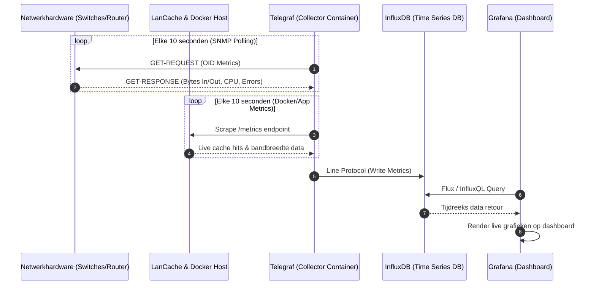

# Module 2: Moderne Netwerkmonitoring (Grafana-Stack)

Dit document beschrijft de technische opzet van de monitoring-pijplijn om realtime metrieken te verzamelen voor het projectverslag.

## 1. Architectuur van de Monitoring-pijplijn

De metrieken stromen vanuit de netwerkhardware en docker-services via een push/pull-mechanisme naar de tijdreeksdatabase, waarna Grafana de visualisatie verzorgt.



## 2. Docker Compose Deployment (`docker-compose.yml`)

Gebruik de onderstaande configuratie om de volledige **TIG-stack** (Telegraf, InfluxDB, Grafana) in één keer uit te rollen op de centrale Linux-server:

```yaml
version: '3.8'

services:
  influxdb:
    image: influxdb:2.7
    container_name: lan_influxdb
    ports:
      - "8086:8086"
    volumes:
      - influxdb_data:/var/lib/influxdb2
    environment:
      - DOCKER_INFLUXDB_INIT_MODE=setup
      - DOCKER_INFLUXDB_INIT_USERNAME=vives_admin
      - DOCKER_INFLUXDB_INIT_PASSWORD=SuperSafePassword123
      - DOCKER_INFLUXDB_INIT_ORG=vives_lan
      - DOCKER_INFLUXDB_INIT_BUCKET=netmetrics
    restart: unless-stopped

  telegraf:
    image: telegraf:latest
    container_name: lan_telegraf
    volumes:
      - ./telegraf.conf:/etc/telegraf/telegraf.conf:ro
    depends_on:
      - influxdb
    restart: unless-stopped

  grafana:
    image: grafana/grafana:latest
    container_name: lan_grafana
    ports:
      - "3000:3000"
    volumes:
      - grafana_data:/var/lib/grafana
    environment:
      - GF_SECURITY_ADMIN_USER=admin
      - GF_SECURITY_ADMIN_PASSWORD=VivesLanGrafana2026
    depends_on:
      - influxdb
    restart: unless-stopped

volumes:
  influxdb_data:
  grafana_data:
```

## 3. Aanbevolen Grafana KPI-Dashboards

Om de werking van het netwerk te bewijzen tijdens de Network Experience, dienen de volgende statistieken prominent op het hoofdscherm getoond te worden:

1. **WAN Internet Doorvoersnelheid:** Live netwerkverkeer (Mbps) op de pfSense WAN-interface om internetbelasting te monitoren.
2. **LanCache Hit Rate:** Een taart- of staafdiagram dat de verhouding toont tussen *Cache Hits* (lokaal geserveerd op 1 Gbps+) en *Cache Misses* (gedownload van internet).
3. **Core Switch Port Status:** Matrix-overzicht van alle switchpoorten die eventuele pakketfouten (CRC errors) of onverwachte 'flapping ports' direct visueel markeert.
4. **ICMP Jitter / Latency:** Realtime ping-metingen naar actieve game-nodes om de stabiliteit van de latency te waarborgen onder hoge netwerkdruk.
