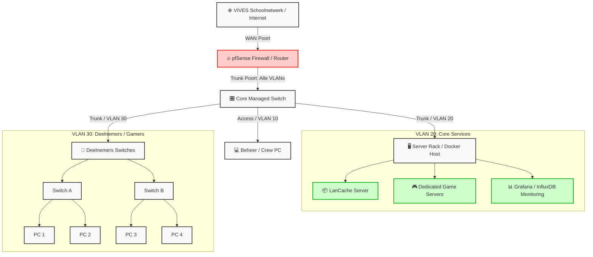
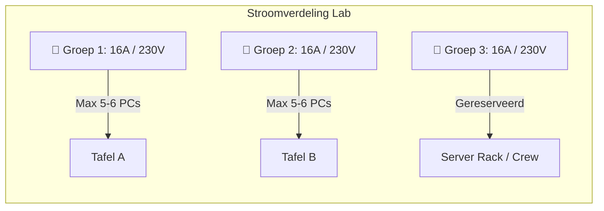

# Module 1: Netwerk Architectuur & Topologie

Dit document beschrijft de fysieke en logische inrichting van de netwerkinfrastructuur om een stabiele gaming-omgeving te garanderen.

## 1. Visuele Topologie (Mermaid)

## 2. Logisch Ontwerp: VLAN & Subnetting

Om broadcast-domeinen te verkleinen en netwerkverkeer strikt te scheiden, hanteren we de volgende indeling:

| VLAN ID     | Netwerknaam      | IP-Range / Subnet | Doel                                                   |
| :---------- | :--------------- | :---------------- | :----------------------------------------------------- |
| **VLAN 10** | Management       | `10.10.10.0/24`   | Beheer van switches, routers en access points.         |
| **VLAN 20** | Core Services    | `10.10.20.0/24`   | Dedicated game servers, LanCache en monitoring host.   |
| **VLAN 30** | Gamers / Clients | `10.10.30.0/22`   | Subnet voor deelnemers (biedt ruimte aan ~1000 hosts). |

## 3. Capaciteitsberekening (Stroom & Netwerk)

### Netwerk Bandbreedte

* **Edge-poorten (Naar de gamer):** Elke pc krijgt een **1 Gbps Full-Duplex** verbinding.
* **Uplinks (Inter-switch trunks):** Minimale vereiste is **Link Aggregation (LACP)** met 2x 1 Gbps-lijnen, of bij voorkeur een dedicated **10 Gbps SFP+** uplink naar de Core Switch om bottlenecks te voorkomen bij gelijktijdige downloads.

### Stroomvoorziening (Lab-veiligheid)

Een gemiddelde gaming-pc verbruikt onder piekbelasting circa **500 Watt**.

* **Formule:** `Vermogen (W) = Spanning (V) × Stroom (A)`
* **Lab-groep:** Een standaard Belgische zekeringgroep levert `230V × 16A = 3.680 Watt`.
* **Veiligheidsmarge (80%):** Belast een groep tot maximaal `approx 2.944 Watt`.
* **Conclusie:** Plaats **maximaal 5 tot 6 gaming-pc's per fysieke stroomkring**. Verdeel de tafels bewust over verschillende wandcontactdozen (groepen) in het VIVES-lab.

