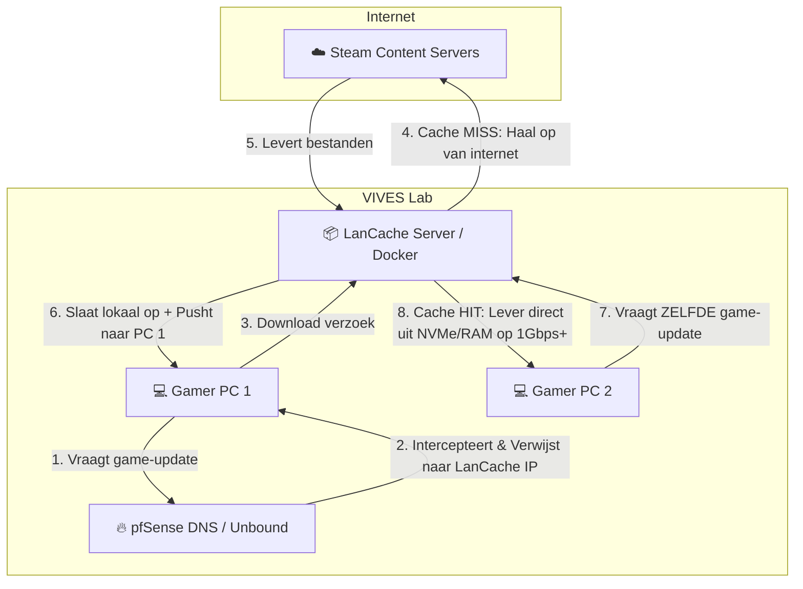

# Module 3: Core Server Services & Optimalisatie

Dit document behandelt de softwarematige inrichting en netwerkaanpassingen om de LAN-party stabiel en performant te houden.

## 1. LanCache.net Werking

LanCache functioneert als een transparante HTTP proxy cache die specifiek is ontworpen voor game-distributieplatformen (Steam, Epic Games, Riot Games, Blizzard, Windows Update).

### Belangrijke LanCache Netwerkvereisten

* **DNS Redirection:** pfSense (Unbound DNS) moet zo geconfigureerd worden dat DNS-aanvragen voor bekende game-CDNs (zoals `*.steampowered.com`) niet naar het internet worden gestuurd, maar resolven naar het lokale IP-adres van de LanCache server.
* **Hardware-advies:** De LanCache server vereist snelle opslag (**NVMe SSD's**) en voldoende RAM om de hoge doorvoersnelheid van meerdere gelijktijdige 1 Gbps client-downloads bij te kunnen houden.

## 2. Netwerkbeveiliging & Stabiliteit op de Switches

Om te voorkomen dat studenten (bewust of onbewust) de infrastructuur platleggen, moeten de managed switches geconfigureerd worden met de volgende protocollen:

### Spanning Tree Protocol (STP / RSTP)

* **Risico:** Een gamer verbindt per ongeluk twee poorten van een switch met dezelfde ethernetkabel (switching loop). Dit veroorzaakt een broadcast storm die de switch CPU 100% belast en het netwerk crasht.

* **Mitigatie:** Activeer **Rapid Spanning Tree Protocol (RSTP)** op alle switches. Schakel `Edge Port` (of `PortFast`) in op poorten naar eindgebruikers, gecombineerd met `BPDU Guard` om de poort direct uit te schakelen zodra er een ongewenste switch wordt gedetectecteerd.

### DHCP Snooping & Rogue DHCP Protection

* **Risico:** Een deelnemer sluit een eigen thuisrouter aan op het netwerk. Deze router begint IP-adressen uit te delen in een foutieve range, waardoor gamers hun internet- en LAN-verbinding verliezen.
* **Mitigatie:** Schakel **DHCP Snooping** in op alle switches. Markeer alléén de uplink-poort die naar de officiële pfSense-router leidt als **Trusted**. Alle overige poorten naar gamers worden gemarkeerd als **Untrusted**. DHCP-aanbiedingen (DHCPOFFER) van untrusted poorten worden direct door de switch gedropt.

## 3. Quality of Service (QoS) & Traffic Shaping op pfSense

Om te voorkomen dat een grote internetdownload (bijvoorbeeld een game die nog niet in de cache staat) de latency (ping) van actieve spelers verpest, richten we **Traffic Shaping** in op de pfSense-firewall via de *Wizard -> Multiple Lan/Wan*:

1. **Realtime Queue (Hoogste Prioriteit):** ICMP (Ping) en bekende game-verkeer UDP-poorten.
2. **Default Queue (Normale Prioriteit):** Standaard webverkeer (HTTP/HTTPS).
3. **Bulk Queue (Laagste Prioriteit):** Grote downloads en netwerkverkeer dat niet gecached kan worden. Er wordt een harde bandbreedtelimiet ingesteld per IP of per subnet voor bulkverkeer.

## 4. Termlijst

Uitleg van de in dit document vetgedrukte termen:

| Term                                    | Uitleg                                                                                                                                                                                                                                                                                                      |
| --------------------------------------- | ----------------------------------------------------------------------------------------------------------------------------------------------------------------------------------------------------------------------------------------------------------------------------------------------------------- |
| **DNS Redirection**                     | Het omleiden van DNS-opvragingen naar domeinen van game-CDNs (bijv. `*.steampowered.com`) zodat deze niet naar het publieke IP van de provider resolven, maar naar het lokale IP-adres van de LanCache-server. Clients downloaden dan transparant vanaf de lokale cache.                                    |
| **NVMe SSD's**                          | Vaste opslag die via de NVMe-protocol over PCIe communiceert. In tegenstelling tot SATA-SSD's kan NVMe duizenden parallelle IOPS verwerken en hoge doorvoersnelheden (GB/s) leveren, waardoor de server meerdere gelijktijdige 1 Gbps client-downloads kan voeden zonder dat de opslag de bottleneck wordt. |
| **Rapid Spanning Tree Protocol (RSTP)** | Een verbetering van het klassieke Spanning Tree Protocol (802.1w). Waar STP tientallen seconden nodig heeft om een loop te blokkeren, herstelt RSTP de spanning tree binnen ~1 seconde. Dit voorkomt broadcast storms en snelle netwerkuitval bij onbedoelde kabelloops.                                    |
| **DHCP Snooping**                       | Een security-functie op managed switches die al het DHCP-verkeer inspecteert. DHCP-aanbod dat van een untrusted poort komt, wordt weggegooid, zodat alleen de officiële DHCP-server (pfSense) IP-adressen kan uitdelen. Dit beschermt tegen zogenaamde rogue DHCP-servers.                                  |
| **Trusted**                             | Een switchpoort die als betrouwbaar is gemarkeerd. Alleen op een trusted poort (de uplink naar de pfSense-router) is DHCP-broadcastverkeer zoals DHCPOFFER toegestaan.                                                                                                                                      |
| **Untrusted**                           | Een switchpoort die standaard niet als betrouwbaar geldt. Op alle untrusted poorten (de gamer-poorten) worden DHCP-aanbiedingen van eindapparatuur direct gedropt door de switch.                                                                                                                           |
| **Traffic Shaping**                     | Een mechanisme op de firewall (pfSense) om uitgaand/inlopend verkeer te verdelen over prioriteitsqueues. Zo krijgt latency-gevoelig verkeer (ping, gaming) altijd voorrang, zelfs als er zware downloads plaatsvinden. (QoS )                                                                               |
| **Realtime Queue**                      | De hoogste prioriteitsqueue. Hierin wordt latency-gevoelig verkeer geplaatst, zoals ICMP (ping) en UDP-gameverkeer, zodat de reactietijd van actieve spelers minimaal blijft.                                                                                                                               |
| **Default Queue**                       | De standaardqueue voor regulier webverkeer (HTTP/HTTPS). Dit verkeer krijgt normale prioriteit, lager dan realtime maar hoger dan bulk.                                                                                                                                                                     |
| **Bulk Queue**                          | De laagste prioriteitsqueue, bedoeld voor grote downloads en niet-cachebaar netwerkverkeer. Deze queue krijgt een harde bandbreedtelimiet per IP/subnet zodat het andere verkeer nooit blokkeert.                                                                                                           |
