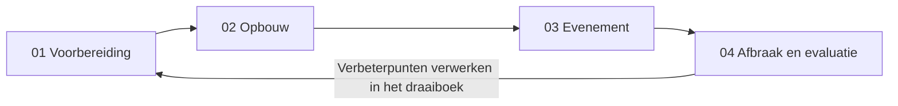
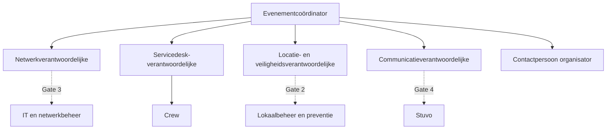
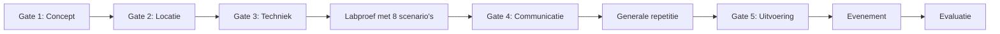

# Draaiboek LAN-party: overzicht

Ik heb dit draaiboek geschreven voor VIVES (organisatie, IT, Stuvo, lokaalbeheer en preventie). Jullie kunnen het bij elke volgende LAN-party opnieuw gebruiken, samen met een studentenvereniging of een andere organisator. Vaktermen staan in de [begrippenlijst](../gedeeld/BEGRIPPEN.md).

## Zo gebruik je dit draaiboek

1. Kopieer de [kerngegevens](#kerngegevens-per-editie) en vul ze in voor deze editie.
2. Werk de fases af in volgorde: [voorbereiding](01_VOORBEREIDING.md), [opbouw](02_OPBOUW.md), [evenement](03_EVENEMENT.md), [afbraak en evaluatie](04_AFBRAAK_EN_EVALUATIE.md). Sjablonen staan in de [bijlagen](05_BIJLAGEN.md).
3. Noteer beslissingen, tests en incidenten in het [logboek](../logging/logboek.md).
4. Pas dit draaiboek na de evaluatie aan, zodat de volgende editie ervan leert.

Zo loopt het van de eerste voorbereiding tot de volgende editie:

Mijn netwerkontwerp voor een LAN van 70 staat in [LAN_70_OPSTELLING.md](../lan-70/LAN_70_OPSTELLING.md). Voor andere groottes zie het [schaalbare ontwerp](../netwerkontwerp/SCHAALBAAR_ONTWERP.md).

## Kerngegevens per editie

| Onderwerp | Invullen |
| :-- | :-- |
| Editie en naam | |
| Datum en uren | |
| Organisator (bijvoorbeeld studentenvereniging) | |
| Lokaal | |
| Verwacht aantal deelnemers (tier S, M of L) | |
| Opbouwvenster en afbraakvenster | |
| Budgeteigenaar | |
| Uplink (snelheid en contactpersoon IT) | |

## Rollen

Wijs voor elke rol een naam en een back-up aan. De verantwoordelijke bewaakt de voortgang en meldt die in het logboek.

| Rol | Verantwoordelijkheid | VIVES-dienst |
| :-- | :-- | :-- |
| Evenementcoördinator | Eindverantwoordelijk, bewaakt de gates | Opleiding of docent |
| Netwerkverantwoordelijke | Ontwerp, opbouw, monitoring, back-ups | IT en netwerkbeheer |
| Servicedesk-verantwoordelijke | Triage, incidentlog, escalatie | Crew |
| Locatie- en veiligheidsverantwoordelijke | Lokaal, stroom, evacuatie, toezicht | Lokaalplanning, gebouwbeheer, preventie |
| Communicatieverantwoordelijke | Inschrijving, privacytekst, berichten | Stuvo |
| Contactpersoon organisator | Aanspreekpunt van de studentenvereniging | Organisator |
| Crew | Opbouw, servicedesk, afbraak | Vrijwilligers |

Zo hangen de rollen samen. De gestippelde lijnen zijn de diensten die in de gates akkoord geven:

Elke rol werkt toe naar de gates die hieronder volgen.

## Go/no-go-gates

Zonder akkoord wordt er geen verbinding gemaakt met het campusnetwerk en wordt er niet gecommuniceerd als officieel evenement.

| Gate | Wat moet goedgekeurd zijn | Akkoord door |
| :-- | :-- | :-- |
| 1 Concept | Doel, doelgroep, datumopties, capaciteit, budgeteigenaar | Evenementcoördinator en opleidingshoofd |
| 2 Locatie | Lokaal, openingsuren, evacuatie, toegankelijkheid, sanitair, toezicht | Lokaalbeheer, preventie en Stuvo |
| 3 Techniek | Uplink, switches, DHCP en routing, stroomplan, toegelaten caching | IT en netwerkbeheer |
| 4 Communicatie | Inschrijving, privacytekst, gedragscode, goedgekeurd bericht | Stuvo en evenementcoördinator |
| 5 Uitvoering | Crew, support, noodnummers, rollback, cleanup | Evenementcoördinator |

Bewaar elk akkoord als bewijsstuk en link het in het logboek.

## Tijdlijn (richtlijn)

`T` is de dag van het evenement. Dit zijn mijn richttermijnen. Pas ze aan op de doorlooptijd van aanvragen bij Stuvo en IT.

| Moment | Mijlpaal | Rol |
| :-- | :-- | :-- |
| T minus 10 weken | Conceptnota, datumopties, begroting. **Gate 1** | Evenementcoördinator |
| T minus 9 weken | Aanvragen bij Stuvo, lokaalbeheer, IT en preventie. **Gate 2** | Locatie- en veiligheidsverantwoordelijke |
| T minus 7 weken | Netwerk-, stroom- en veiligheidsplan. **Gate 3** | Netwerkverantwoordelijke |
| T minus 5 weken | Labproef met de 8 verplichte scenario's | Netwerkverantwoordelijke |
| T minus 4 weken | Communicatie klaar, inschrijving open na akkoord. **Gate 4** | Communicatieverantwoordelijke |
| T minus 2 weken | Generale repetitie met meerdere clients | Evenementcoördinator |
| T minus 1 week | Formele go/no-go. **Gate 5** | Evenementcoördinator |
| T | Opbouw, evenement, afbraak | Iedereen |
| T plus 1 week | Evaluatie en verbeterpunten | Evenementcoördinator |

## De 8 verplichte scenario's

Elk scenario wordt in de labproef getest voor het evenement.

1. Een nieuwe deelnemer aansluiten en connectiviteit krijgen.
2. Een foutief aangesloten DHCP- of routercomponent detecteren zonder het campusnetwerk te beïnvloeden.
3. Een cache hit en cache miss testen met een werkende fallback.
4. Een gameserver bereiken en de basisbelasting meten.
5. Een kabel-, switchpoort- of gameserverstoring diagnosticeren.
6. De cache uitschakelen zonder algemene internettoegang te verbreken.
7. Een monitoringalarm ontvangen en volgens dit draaiboek behandelen.
8. De configuratie van een switch of service herstellen.

Geen akkoord voor het evenement betekent een tabletopoefening en een goedgekeurde dry-run, met dezelfde technische en organisatorische aanpak.

## Volgende stap

Begin met de [voorbereiding](01_VOORBEREIDING.md).
