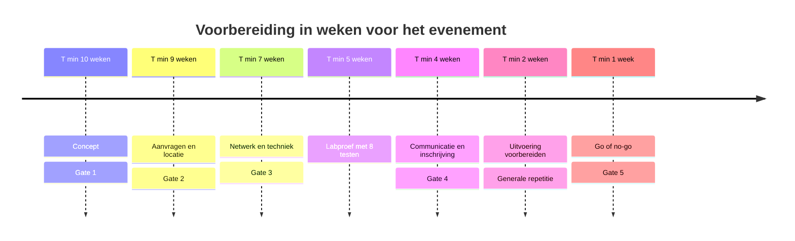

# Fase 1: Voorbereiding

Vink af in je eigen kopie. Rollen en gates staan in het [overzicht](00_OVERZICHT.md). Volgende fase: [opbouw](02_OPBOUW.md).

De voorbereiding loopt langs vijf gates. De tijdlijn hieronder laat zien wanneer elk blok aan de beurt is, en elk blok krijgt daarna zijn eigen checklist.

## T minus 10 weken: concept (Gate 1)

- [ ] Doel, doelgroep en gewenste capaciteit vastgelegd.
- [ ] Datumopties bepaald.
- [ ] Stakeholders en contactpersonen geregistreerd.
- [ ] Rollen ingevuld, met back-up.
- [ ] Begroting en budgeteigenaar bepaald.
- [ ] Risicoanalyse opgesteld.
- [ ] Gate 1 geregistreerd in het logboek.

## T minus 9 weken: aanvragen en locatie (Gate 2)

- [ ] Aanvraag ingediend bij Stuvo en de betrokken interne diensten (schriftelijk, met voldoende doorlooptijd).
- [ ] Lokaal en openingsuren bevestigd.
- [ ] Evacuatie, nooduitgangen en toezicht gecontroleerd met preventie.
- [ ] Toegankelijkheid en sanitair gecontroleerd.
- [ ] Stroomplan en kabelroutes goedgekeurd.
- [ ] Capaciteit van tafels, stoelen en netwerkpoorten gecontroleerd.
- [ ] Opbouw- en afbraakvenster afgesproken met gebouwbeheer.
- [ ] Gate 2 geregistreerd.

## T minus 7 weken: netwerk en techniek (Gate 3)

- [ ] Uplink en netwerkdiensten bevestigd met IT.
- [ ] Toestemming voor eigen firewall, DHCP en DNS bevestigd (anders niet gebruiken).
- [ ] Netwerkontwerp gekozen volgens de tier ([70 deelnemers](../lan-70/LAN_70_OPSTELLING.md) of het [schaalbare ontwerp](../netwerkontwerp/SCHAALBAAR_ONTWERP.md)).
- [ ] IP-plan, DHCP-capaciteit en bandbreedte gecontroleerd.
- [ ] Stroomplan: aantal groepen en pc's per groep.
- [ ] Cachingstrategie en toegelaten platformen bevestigd.
- [ ] Monitoring en dashboards gepland.
- [ ] Wachtwoorden en andere geheimen staan in een `.env`-bestand buiten de repository.
- [ ] Gate 3 geregistreerd.

## T minus 5 weken: labproef

- [ ] Proefopstelling gebouwd in een toegelaten omgeving.
- [ ] Alle 8 [scenario's](00_OVERZICHT.md#de-8-verplichte-scenarios) uitgevoerd en in het logboek genoteerd.
- [ ] Cachebenchmark gemaakt: opslag, hitratio, DNS-impact en fallback.
- [ ] Switch- en serviceconfiguraties gebackupt zonder geheimen.
- [ ] Rollback- en herstelprocedure getest.
- [ ] Beslissing over de plaats van de cache genomen (zie het 70-ontwerp, sectie 6).

## T minus 4 weken: communicatie en inschrijving (Gate 4)

- [ ] Inschrijfformulier met alleen noodzakelijke gegevens.
- [ ] Privacytekst en bewaartermijn bepaald.
- [ ] Deelnemersvoorwaarden en gedragscode goedgekeurd.
- [ ] Aankondiging goedgekeurd. **Geen officiële communicatie vóór akkoord.**
- [ ] Compatibiliteitschecklist voor deelnemers klaar (zie [bijlagen](05_BIJLAGEN.md)).
- [ ] Privacytoestemming voor leaderboard of stream geregeld.
- [ ] Gate 4 geregistreerd. Daarna pas de inschrijving openen.

## T minus 2 weken: uitvoering voorbereiden

- [ ] Crew geworven en ploegenschema gemaakt.
- [ ] Servicedeskprocedure doorgenomen met de crew.
- [ ] Reservekabels en hulpmateriaal geïnventariseerd.
- [ ] Noodnummers en contactlijst gedeeld (zie [bijlagen](05_BIJLAGEN.md)).
- [ ] Rollback- en noodplan (no-go) opgesteld.
- [ ] Toernooischema en regels klaar, indien van toepassing.
- [ ] Generale repetitie met meerdere clients uitgevoerd.
- [ ] Cache vooraf gevuld met de afgesproken spellen.

## T minus 1 week: go/no-go (Gate 5)

- [ ] Draaiboek gedeeld met de crew.
- [ ] Alle verplichte testen geslaagd of risico's bewust geaccepteerd.
- [ ] Aantal inschrijvingen past binnen de capaciteit (stroom, poorten, tafels).
- [ ] Formele go/no-go geregistreerd met naam, datum en besluit.

## Volgende stap

Bij een go begint de [opbouw](02_OPBOUW.md). Bij een no-go volgt een tabletopoefening en een goedgekeurde dry-run (zie het [overzicht](00_OVERZICHT.md)).
