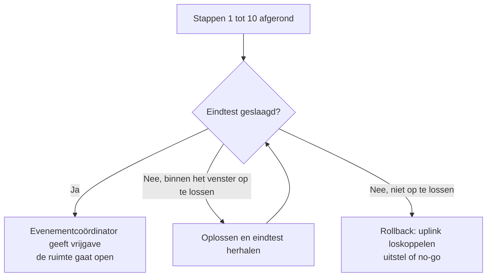

# Fase 2: Opbouw

Op de opbouwdag wordt het lokaal veilig en volgens plan ingericht en wordt het netwerk getest voor de deelnemers komen. Doe dit alleen binnen het afgesproken opbouwvenster. Vorige fase: [voorbereiding](01_VOORBEREIDING.md). Volgende fase: [evenement](03_EVENEMENT.md).

## Volgorde

De volgorde staat vast, omdat elke stap op de vorige steunt. Tijden zijn relatief aan het begin van het opbouwvenster.

| Stap | Wat | Rol | Richtduur |
| :-- | :-- | :-- | :-- |
| 1 | Lokaal controleren: nooduitgangen vrij, geen blokkades, noodnummers opgehangen | Locatie- en veiligheidsverantwoordelijke | 30 min |
| 2 | Tafels en stoelen plaatsen volgens plan | Crew | 60 min |
| 3 | Stroom controleren en verdelen over de groepen volgens plan | Locatie- en veiligheidsverantwoordelijke | 45 min |
| 4 | Netwerkapparatuur plaatsen: switches, firewall, server | Netwerkverantwoordelijke | 30 min |
| 5 | Uplink aansluiten **na bevestiging van IT** | Netwerkverantwoordelijke | 15 min |
| 6 | Configuratie laden of herstellen (zonder geheimen) | Netwerkverantwoordelijke | 30 min |
| 7 | Kabels leggen en elke kabel en poort labelen | Crew | 90 min |
| 8 | Monitoring en dashboard starten | Netwerkverantwoordelijke | 20 min |
| 9 | Servicedesk inrichten | Servicedesk-verantwoordelijke | 20 min |
| 10 | Eindtest (zie hieronder) | Netwerkverantwoordelijke en crew | 45 min |

De richtduren zijn mijn schatting voor ongeveer 70 deelnemers. Ik heb ze niet gemeten. Meet de echte tijden en pas ze na de evaluatie aan.

## Regels voor kabels en stroom

- Leg kabels niet over looproutes. Gebruik kabelmatten of leg ze langs de rand.
- Label beide kanten van elke kabel volgens de labelconventie in de [bijlagen](05_BIJLAGEN.md).
- Overschrijd het afgesproken aantal pc's per stroomgroep nooit.
- Houd de plek bij de servers vrij en afgeschermd van deelnemers.

## Eindtest vóór de opening

Pas als alles hieronder is afgevinkt, mag de ruimte open voor deelnemers.

- [ ] Alle switches bereikbaar in het beheernetwerk.
- [ ] Een testpc op elk uiteinde van het lokaal krijgt automatisch een adres.
- [ ] Testpc's hebben internet via de uplink.
- [ ] Een cache hit en een cache miss werken (testdownload).
- [ ] De gameserver is bereikbaar vanaf een testpc.
- [ ] Het monitoringdashboard toont verkeer, poortstatus en latency.
- [ ] Een rogue DHCP-test (eigen router op een poort) wordt geblokkeerd.
- [ ] Noodnummers hangen zichtbaar. Evacuatieroutes zijn vrij.
- [ ] De servicedesk is bemand en de incidentlog ligt klaar.

## Rollback

Lukt de eindtest niet binnen het venster, dan beslist de evenementcoördinator over uitstel of no-go. Het netwerk van VIVES mag nooit hinder ondervinden: haal de uplink los als er twijfel is over de invloed op het campusnetwerk.

## Volgende stap

Na de vrijgave begint het [evenement](03_EVENEMENT.md).
