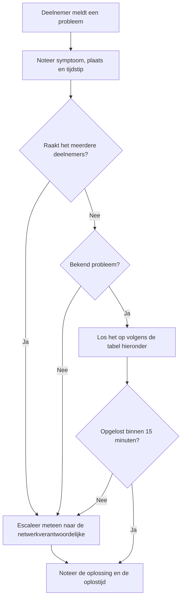
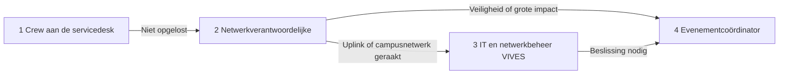

# Fase 3: Evenement

Tijdens het evenement staat de servicedesk voor de deelnemers klaar en bewaakt de netwerkverantwoordelijke het dashboard. Vorige fase: [opbouw](02_OPBOUW.md). Volgende fase: [afbraak en evaluatie](04_AFBRAAK_EN_EVALUATIE.md).

## Dagelijkse controles

| Moment | Wat | Rol |
| :-- | :-- | :-- |
| Voor de opening | Dashboard nakijken (uitleg in de [monitoring-README](../monitoring/README.md#het-dashboard-uitgelegd)): uplink, poortstatus, latency, cache. Het paneel Actieve alarmen moet leeg zijn | Netwerkverantwoordelijke |
| Elk uur | Dashboard bekijken en een korte notitie in de incidentlog als er iets afwijkt | Netwerkverantwoordelijke |
| Elk uur | Rondgang: kabels, stroomkabels en looproutes | Crew |
| Na de sluiting | Samenvatting van de dag in het logboek | Servicedesk-verantwoordelijke |

## Servicedesk: triage

Elke vraag wordt opgenomen in de incidentlog (sjabloon in de [bijlagen](05_BIJLAGEN.md)). Noteer **geen** persoonsgegevens.

Het schema hieronder is de vaste route van een melding. De tabel met bekende problemen volgt daarna.

## Escalatiepad

| Niveau | Wie | Wanneer |
| :-- | :-- | :-- |
| 1 | Crew aan de servicedesk | Individuele vragen en bekende problemen |
| 2 | Netwerkverantwoordelijke | Storing op een tafel, switch, de cache of een server |
| 3 | IT en netwerkbeheer van VIVES | Probleem met de uplink of invloed op het campusnetwerk |
| 4 | Evenementcoördinator | Beslissing om te pauzeren, te stoppen of te evacueren |

## Bekende problemen en oplossingen

| Symptoom | Controle | Actie |
| :-- | :-- | :-- |
| Deelnemer heeft geen netwerk | Brandt het linklampje? Heeft de pc een adres in het deelnemersbereik? | Kabel en poort wisselen. Geen adres: poort en VLAN controleren |
| Poort is uitgeschakeld | Staat er een eigen switch of een kabel in een kring op die poort? | Apparaat verwijderen en poort opnieuw activeren |
| Deelnemer krijgt een adres buiten het deelnemersbereik | Is er een eigen router aangesloten? | Poort uitschakelen via de snooping-log (scenario 2), apparaat verwijderen |
| Hele tafel of switch valt uit | Stroomgroep, switchlampjes, uplink tussen de switches | Groep of kabel herstellen. Pc's zo nodig verplaatsen naar een andere groep binnen het maximum |
| Alles traag, hoge ping | Dashboard: uplink vol, cachehitrate, bulk queue | Vraag IT naar de uplink. Controleer of de cache bereikt wordt |
| Downloads mislukken of zijn traag | Draait de cache? Wijst de DNS-override naar de juiste server? | Cache herstarten. Lukt dat niet: DNS-override uitschakelen zodat clients rechtstreeks naar het internet gaan (scenario 6) |
| Gameserver niet bereikbaar | Draait de container? | Container herstarten en melden aan de netwerkverantwoordelijke |
| Monitoringalarm | Wat meldt het dashboard? | Volg de tabel: dezelfde symptomen, zelfde aanpak. Monitoring uitval raakt deelnemers niet |
| Configuratie van een switch of service is kapot | Wat is er veranderd? | Laatste back-up zonder geheimen terugzetten (scenario 8) |

## Noodsituaties

Bij brand, een medische noodsituatie of een andere onveilige situatie gaat veiligheid altijd voor het netwerk.

1. Bel de nood- of hulpdienst volgens de noodnummers op de contactlijst.
2. Volg de evacuatieinstructies van preventie en gebouwbeheer.
3. De evenementcoördinator beslist over pauze of stop.
4. Noteer het incident achteraf in het logboek, zonder gevoelige persoonsgegevens.

## Wanneer stop je?

De evenementcoördinator overweegt een pauze of stop bij:

- een onveilige situatie of een noodgeval;
- een storing die niet binnen een afgesproken tijd opgelost is en veel deelnemers raakt;
- invloed op het campusnetwerk die IT meldt.

## Volgende stap

Na de sluiting begint de [afbraak](04_AFBRAAK_EN_EVALUATIE.md).
