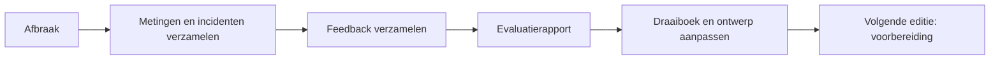

# Fase 4: Afbraak en evaluatie

Afbraak gebeurt binnen het afgesproken venster. De evaluatie zorgt dat de volgende editie beter verloopt. Vorige fase: [evenement](03_EVENEMENT.md).

## Afbraak

Werk in omgekeerde volgorde van de opbouw.

| Stap | Wat | Rol |
| :-- | :-- | :-- |
| 1 | Deelnemers laten vertrekken en de laatste data veiligstellen | Servicedesk-verantwoordelijke |
| 2 | Uplink loskoppelen | Netwerkverantwoordelijke |
| 3 | Back-up van configuraties en metingen maken (zonder geheimen) | Netwerkverantwoordelijke |
| 4 | Dashboard en metingen exporteren voor de evaluatie | Netwerkverantwoordelijke |
| 5 | Apparatuur afbouwen, kabels oprollen en tellen | Crew |
| 6 | Tafels en stoelen terugzetten | Crew |
| 7 | Lokaal controleren op schade en afval | Locatie- en veiligheidsverantwoordelijke |
| 8 | Lokaal overdragen aan gebouwbeheer | Locatie- en veiligheidsverantwoordelijke |

Controleer na afloop:

- [ ] Alle apparatuur en reservekabels zijn terug.
- [ ] Het lokaal is in dezelfde staat als voor de opbouw.
- [ ] Stroomkabels en tijdelijke bevestigingen zijn verwijderd.
- [ ] De apparatuur is niet meer verbonden met het campusnetwerk.

## Evaluatie (T plus 1 week)

### Metingen verzamelen

- [ ] Mediane latency en packet loss.
- [ ] Cachewinst: hit rate en bespaard internetverkeer.
- [ ] Aantal deelnemers en bezettingsgraad.
- [ ] Opbouw- en afbraaktijd ten opzichte van het venster.
- [ ] Aantal supportvragen en gemiddelde oplostijd.
- [ ] Incidenten en genomen maatregelen.

### Feedback

- [ ] Deelnemersfeedback verzameld.
- [ ] Feedback van de crew en de organisator verzameld.
- [ ] Feedback van IT, lokaalbeheer en preventie verzameld.

### Rapport en verbetering

- [ ] Evaluatierapport geschreven op basis van de metingen en incidenten.
- [ ] Wat ging goed, wat niet en wat doen we de volgende keer anders?
- [ ] **Dit draaiboek aangepast** (rolverdeling, tijden, checklists).
- [ ] Netwerkontwerp aangepast als er knelpunten waren.
- [ ] Alle beslissingen en bewijsstukken in het logboek gelinkt.

## Gegevens opruimen

- [ ] Inschrijvingsgegevens en andere persoonsgegevens verwijderd na het verstrijken van de bewaartermijn uit de privacytekst.
- [ ] Controle dat er geen geheimen of persoonsgegevens in de repository staan.

## Zo leert het draaiboek mee

De evaluatie sluit de cirkel. Wat ik hier leer, gaat terug in het draaiboek voor de volgende editie.

Terug naar het [overzicht](00_OVERZICHT.md) of naar de [voorbereiding](01_VOORBEREIDING.md) van de volgende editie.
