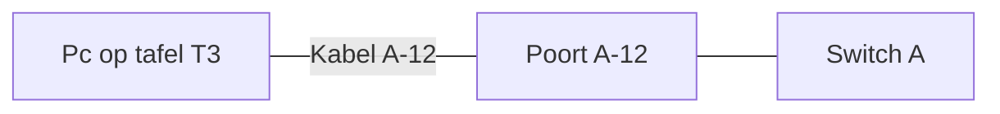

# Bijlagen

Sjablonen om te kopiëren voor elke editie. Terug naar het [overzicht](00_OVERZICHT.md).

## Contactlijst

Zet de lijst op papier bij de servicedesk. Zet er geen privégegevens van deelnemers in.

| Rol | Naam | Telefoon | Back-up |
| :-- | :-- | :-- | :-- |
| Evenementcoördinator | | | |
| Netwerkverantwoordelijke | | | |
| IT en netwerkbeheer VIVES | | | |
| Gebouwbeheer en lokaalplanning | | | |
| Preventie | | | |
| Stuvo | | | |
| Contactpersoon organisator | | | |
| Nood- en hulpdiensten | | | |

## Incidentlog

Eén regel per incident of supportvraag. Geen namen of andere persoonsgegevens van deelnemers.

| Tijd | Plaats (tafel of poort) | Symptoom | Actie | Opgelost om | Doorgestuurd naar |
| :-- | :-- | :-- | :-- | :-- | :-- |
| | | | | | |

De gemiddelde oplostijd voor de evaluatie volgt uit deze tabel.

## Go/no-go-formulier

| Gate | Datum | Besluit (go of no-go) | Voorwaarden | Akkoord door | Bewijs |
| :-- | :-- | :-- | :-- | :-- | :-- |
| 1 Concept | | | | | |
| 2 Locatie | | | | | |
| 3 Techniek | | | | | |
| 4 Communicatie | | | | | |
| 5 Uitvoering | | | | | |

## Labelconventie

Een eenduidig label per kabel en poort maakt storingen snel vindbaar.

| Wat | Formaat | Voorbeeld |
| :-- | :-- | :-- |
| Switch | Letter | `A`, `B` |
| Poort | Switch en poortnummer | `A-12` |
| Kabel | Beide uiteinden hetzelfde label | `A-12` aan de switch en `A-12` aan de tafel |
| Tafel | Letter en nummer | `T3` |

Houd een tabel bij die elke poort aan een tafelplaats koppelt, zodat de servicedesk bij een storing meteen ziet waar de pc staat.

Zo loopt één kabel van de pc naar de switch. Beide uiteinden dragen hetzelfde label:

## Compatibiliteitschecklist voor deelnemers

Stuur dit mee in de praktische informatie (na akkoord op Gate 4).

- [ ] Netwerkkaart van minstens 1 Gbps en een netwerkkabel (of leen er een).
- [ ] Besturingssysteem en games zijn bijgewerkt of worden via de cache bijgewerkt.
- [ ] Automatisch IP-adres (DHCP) ingesteld.
- [ ] Geen eigen router, switch of access point meebrengen.
- [ ] Alleen legale games van toegelaten platformen.
- [ ] Gedragscode gelezen en geaccepteerd.
- [ ] Toestemming gegeven of geweigerd voor leaderboard en stream.

## Hardwarechecklist

- [ ] Switches (aantal volgens het ontwerp) en voedingskabels.
- [ ] Firewall en server met voeding.
- [ ] Crew-pc.
- [ ] Netwerkkabels (aantal deelnemers plus 10 reserve) en reserveapparatuur.
- [ ] Labels en stiften.
- [ ] Stekkerdozen en verlengkabels die voldoen aan de eisen van het gebouw.
- [ ] Kabelmatten of tape voor looproutes.
- [ ] Printout van de contactlijst en het draaiboek.
