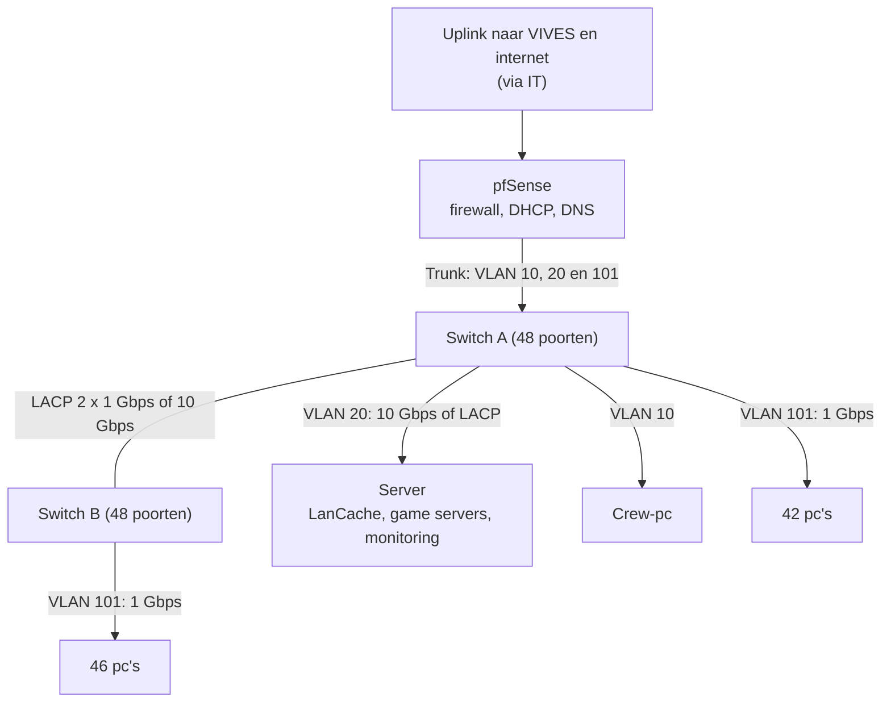
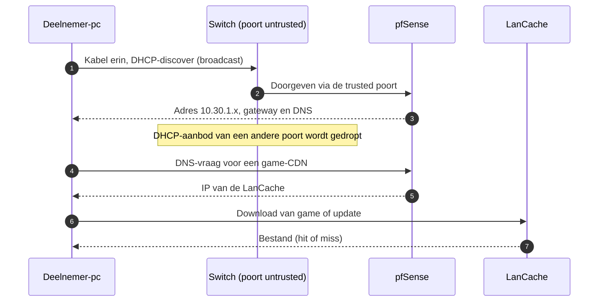
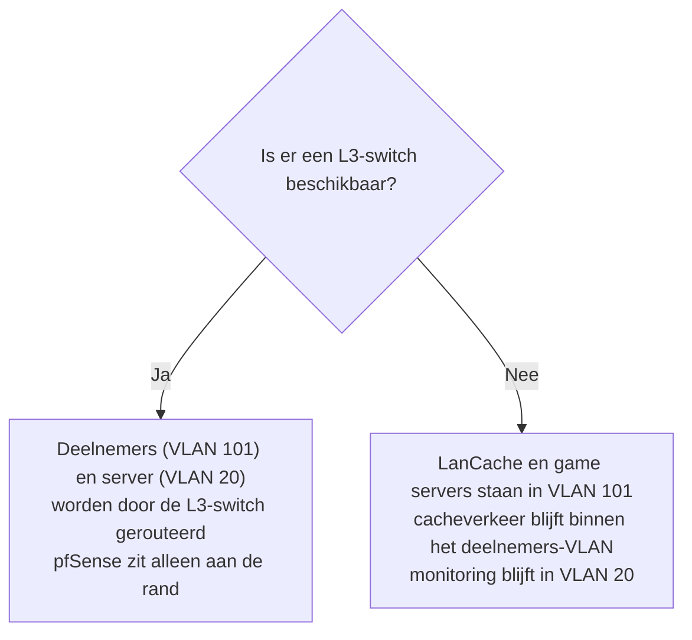

# LAN voor 70 deelnemers: netwerkopstelling

Ik heb dit document geschreven voor de studentenvereniging. Ik beschrijf hoe het netwerk van een LAN-party met 70 deelnemers eruitziet, wat jullie nodig hebben en wat jullie met VIVES moeten afspreken. Vaktermen zijn gelinkt naar de [begrippenlijst](../gedeeld/BEGRIPPEN.md).

Het is een **ontwerp**. Ik sluit niets aan op het netwerk van VIVES vóór IT en de andere diensten akkoord hebben gegeven. Hoe het evenement zelf verloopt (planning, rollen, opbouw, incidenten) staat in het [draaiboek](../draaiboek/00_OVERZICHT.md).

## 1. In het kort

- Alle deelnemers zitten in **één [blok](../gedeeld/BEGRIPPEN.md#blok)**: één [VLAN](../gedeeld/BEGRIPPEN.md#vlan) met één `/24`-[subnet](../gedeeld/BEGRIPPEN.md#subnet). Dat is het kleinste formaat uit het [schaalbare ontwerp](../netwerkontwerp/SCHAALBAAR_ONTWERP.md), dus de opstelling kan later meegroeien.
- Twee managed switches van 48 poorten bieden plaats aan 88 pc's. Voor 70 deelnemers blijven er dus 18 poorten over als reserve.
- Een [LanCache](../gedeeld/BEGRIPPEN.md#lancache) bewaart game-downloads lokaal, zodat de internetverbinding van VIVES niet verstopt raakt.
- Een monitoringdashboard met alarmen laat de crew zien wat er op het netwerk gebeurt. De kant-en-klare stack staat in [monitoring/lan-70](../monitoring/lan-70/README.md).

## 2. Wat je nodig hebt

| Wat | Aantal | Opmerking |
| :-- | :-- | :-- |
| Firewall/router ([pfSense](../gedeeld/BEGRIPPEN.md#pfsense)) | 1 | Een eigen router of DHCP-server vraagt toestemming van IT |
| Managed switch, 48 poorten | 2 | Moet [RSTP](../gedeeld/BEGRIPPEN.md#rstp), [BPDU Guard](../gedeeld/BEGRIPPEN.md#bpdu-guard) en [DHCP snooping](../gedeeld/BEGRIPPEN.md#dhcp-snooping) ondersteunen |
| Server (Docker-host) | 1 | Met [NVMe-ssd](../gedeeld/BEGRIPPEN.md#nvme-ssd) en 10 Gbps netwerkkaart (of twee van 1 Gbps) |
| Crew-pc | 1 | Voor beheer en het dashboard |
| Netwerkkabels (Cat5e of beter) | 70 + 10 reserve | Lengte hangt af van de tafelindeling |
| Labels | 1 set | Elke poort en elke kabel wordt gelabeld |

## 3. Schema

## 4. Adressen en poorten

| VLAN | Naam | Subnet | Inhoud |
| :-- | :-- | :-- | :-- |
| 10 | Management | `10.10.10.0/24` | Switches, pfSense en crew-pc |
| 20 | Core Services | `10.10.20.0/24` | Server |
| 101 | Deelnemers (blok 1) | `10.30.1.0/24` | Alle pc's. [Gateway](../gedeeld/BEGRIPPEN.md#gateway) `10.30.1.1`, [DHCP-scope](../gedeeld/BEGRIPPEN.md#dhcp-scope) bijvoorbeeld `10.30.1.20` tot `10.30.1.250` |

| Switch | Poort | Gebruik |
| :-- | :-- | :-- |
| A | 1 | Trunk naar pfSense |
| A | 2 en 3 | Server (VLAN 20), samengevoegd met [LACP](../gedeeld/BEGRIPPEN.md#lacp) |
| A | 4 | Crew-pc (VLAN 10) |
| A | 5 tot 46 | Deelnemers (VLAN 101): 42 poorten |
| A | 47 en 48 | LACP naar switch B |
| B | 1 en 2 | LACP naar switch A |
| B | 3 tot 48 | Deelnemers (VLAN 101): 46 poorten |

### Wat er gebeurt als een deelnemer inplugt

Met dit plan op papier volgt hier wat een pc doorloopt van kabel tot download. Hierin zie je ook waar de beveiliging uit sectie 7 ingrijpt.

## 5. Stroom

| Stap | Berekening | Resultaat |
| :-- | :-- | :-- |
| Verbruik pc's | 70 x 500 W | 35 000 W |
| Pc's per [stroomgroep](../gedeeld/BEGRIPPEN.md#stroomgroep) | 2 944 W / 500 W | 5 |
| Groepen voor pc's | 70 / 5 | 14 |
| Server en switches | | 1 extra groep |

Ik reken dus op ongeveer **15 groepen**. Ik vraag aan lokaalbeheer welke groepen er in het lokaal echt zijn. Monitors en andere apparatuur zitten niet in deze berekening. De tafels verdeel ik bewust over de groepen.

## 6. Bandbreedte en cache

Een rekenvoorbeeld met aannames die ik nog in de labproef meet: 10% van de deelnemers downloadt tegelijk met 100 Mbps. Dat is 70 x 10% x 100 Mbps = **0,7 Gbps**, ruim binnen wat één LanCache aankan.

Drie dingen maken het verschil:

- **Vul de cache vooraf.** Laat in de dagen vóór het evenement de populaire spellen één keer downloaden, zodat alle deelnemers een [cache hit](../gedeeld/BEGRIPPEN.md#cache-hit-en-cache-miss) krijgen. Alleen voor toegelaten platformen.
- **De server is de eerste [bottleneck](../gedeeld/BEGRIPPEN.md#bottleneck).** Met één kabel van 1 Gbps delen alle 70 deelnemers samen 1 Gbps bij een massadownload. Daarom een netwerkkaart van 10 Gbps, of twee kabels met LACP.
- **De koppeling tussen de switches** (2 x 1 Gbps) is ook beperkt voor de 46 pc's op switch B. Heeft een switch 10 Gbps-poorten, gebruik die dan.

### Waar staat de cache?

Het verkeer tussen deelnemers (VLAN 101) en de server (VLAN 20) moet door een [router](../gedeeld/BEGRIPPEN.md#routering). Op pfSense kan dat die verbinding verzadigen.

| Situatie | Oplossing |
| :-- | :-- |
| Een [L3-switch](../gedeeld/BEGRIPPEN.md#l3-switch) is beschikbaar | Laat die routeren tussen VLAN 101 en VLAN 20 (aanbevolen) |
| Alleen gewone switches en pfSense | Zet LanCache en game servers in het deelnemers-VLAN (101), zodat dit verkeer niet door pfSense gaat. Monitoring blijft in VLAN 20 |

Het schema hieronder vat de keuze samen. Ik kies in de labproef (scenario 3) welke opstelling het beste werkt.

## 7. Beveiliging

Het blok beschermt zichzelf met drie instellingen op elke switch:

- **RSTP en BPDU Guard:** sluit een deelnemer per ongeluk een kabel in een kring of een eigen switch aan, dan schakelt de poort zichzelf uit.
- **DHCP snooping:** alleen de poort naar pfSense is [trusted](../gedeeld/BEGRIPPEN.md#trusted-en-untrusted). Een eigen router van een deelnemer kan dus geen adressen uitdelen.

Een storing blijft zo binnen het blok en raakt de rest van het VIVES-netwerk niet.

## 8. Wat deelnemers moeten weten

- Neem een netwerkkabel mee of leen er een bij de crew.
- De netwerkkaart moet 1 Gbps ondersteunen. Het IP-adres komt automatisch via DHCP.
- **Sluit geen eigen router, switch of access point aan.** Die poort wordt automatisch uitgeschakeld.
- Spelen en downloaden kan alleen met legale bestanden van toegelaten platformen.
- Het verkeer van deelnemers wordt niet inhoudelijk bekeken.

## 9. Afspraken met VIVES

Vul dit samen met mij in vóór de aanvraag. Het draaiboek van VIVES gaat uit van deze gegevens.

| Onderwerp | Afspraak |
| :-- | :-- |
| Datum en lokaal | |
| Opbouw- en afbraakvenster | |
| Uplink (snelheid en poort) en contactpersoon IT | |
| Aantal stroomgroepen en contactpersoon lokaalbeheer | |
| Wie levert switches, firewall en server | |
| Wie bemant de servicedesk | |
| Contactpersoon preventie en noodnummers | |

## 10. Later opschalen

Groeit het evenement tot ongeveer 180 deelnemers, dan blijft het bij dit ene blok: voeg switches toe. Daarboven komt een tweede blok (VLAN 102, `10.30.2.0/24`) met een L3-switch als [core](../gedeeld/BEGRIPPEN.md#core-switch), zoals beschreven in het [schaalbare ontwerp](../netwerkontwerp/SCHAALBAAR_ONTWERP.md).

## 11. Aannames en openstaande punten

1. Ik heb de uplink van VIVES en de toestemming voor een eigen firewall en DHCP-server nog niet bevestigd gekregen.
2. Ik heb het aantal beschikbare stroomgroepen nog niet gecontroleerd.
3. Ik heb nog niet beslist of we een L3-switch gebruiken.
4. De wachtwoorden voor de monitoring (InfluxDB en Grafana) zet ik in een `.env`-bestand buiten de repository.

Als deze punten rond zijn, is de volgende stap het [draaiboek](../draaiboek/00_OVERZICHT.md): daarin staat wie wat doet, van de eerste aanvraag tot de afbraak.
