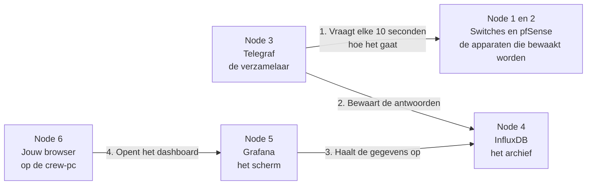
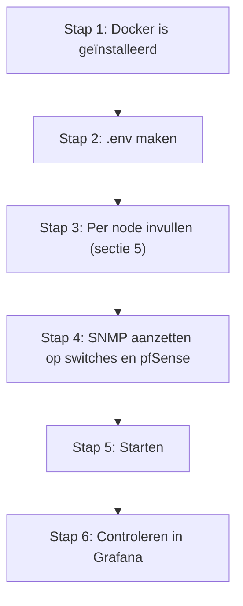

# Handleiding: de monitoring opzetten

Ik heb deze handleiding geschreven voor iemand zonder voorkennis. Je leert hoe je het instellingenbestand `.env` invult, wat elk onderdeel (elke "node") doet, en hoe je per onderdeel controleert of het werkt. Vaktermen zijn gelinkt naar de [begrippenlijst](../gedeeld/BEGRIPPEN.md).

## Inhoud

1. [Wat doet dit?](#1-wat-doet-dit)
2. [Het stappenplan](#2-het-stappenplan)
3. [Wat je nodig hebt](#3-wat-je-nodig-hebt)
4. [Het .env-bestand maken](#4-het-env-bestand-maken)
5. [Per onderdeel: invullen en controleren](#5-per-onderdeel-invullen-en-controleren)
6. [Alles starten](#6-alles-starten)
7. [Een apparaat toevoegen](#7-een-apparaat-toevoegen)
8. [Veelgemaakte fouten](#8-veelgemaakte-fouten)

## 1. Wat doet dit?

Het systeem houdt bij hoe het netwerk van de LAN-party het doet en laat dat op een scherm zien. Het bestaat uit zes onderdelen die ik "nodes" noem:



| Node | Wat het is | In gewone taal |
| :-- | :-- | :-- |
| 1 | Switches | De "stekkerdozen" van het netwerk. Elke pc is erop aangesloten. Ze weten hoeveel verkeer er langs komt en of een kabel werkt. |
| 2 | pfSense | De "poortwachter" naar het internet. Hij weet hoeveel internetverkeer er is. |
| 3 | Telegraf | De "inspecteur". Hij vraagt elke 10 seconden aan alle apparaten hoe het gaat. |
| 4 | InfluxDB | Het "archief". Hier staan alle metingen met een tijdstip erbij. |
| 5 | Grafana | Het "scherm". Het maakt grafieken en geeft alarm. |
| 6 | Jouw browser | Het "venster" waarmee je naar Grafana kijkt. |

Nodes 3, 4 en 5 draaien samen op één computer: de server. Ze starten allemaal met één commando. De switches en pfSense bestaan al en moet je alleen toestemming geven om hun gegevens te delen.

## 2. Het stappenplan



Ga de stappen na elkaar af. Sla er geen over: elke stap bouwt op de vorige.

## 3. Wat je nodig hebt

- Een computer of server met **Docker** erop. Op Windows is dat Docker Desktop. Zet het aan en wacht tot onderin "Engine running" staat.
- De map `monitoring` uit deze repository. Voor de LAN van 70 gebruik je de map [lan-70](lan-70/README.md): daar staat al een ingevulde `.env` met gegenereerde wachtwoorden. Je hoeft dan alleen de IP-adressen te controleren en de community op de apparaten te zetten.
- De **IP-adressen** van de switches en pfSense. Die staan in het IP-plan en op de apparaten zelf. Een [IP-adres](../gedeeld/BEGRIPPEN.md#ip-adres) is het nummer waarmee je een apparaat vindt, bijvoorbeeld `10.10.10.2`.
- Toegang tot het beheerscherm van de switches en pfSense.
- Een plek om wachtwoorden veilig op te slaan, bijvoorbeeld een wachtwoordmanager. Zet ze nooit in een chat, mail of git.

## 4. Het .env-bestand maken

Het [.env-bestand](../gedeeld/BEGRIPPEN.md#env-bestand) is het instellingenbestand. Alles wat je moet invullen staat hierin, op één plek.

1. Open een terminal (PowerShell op Windows) en ga naar de map. Voor de LAN van 70 is dat:

   ```powershell
   cd monitoring\lan-70
   ```

2. Maak een kopie van het voorbeeldbestand:

   ```powershell
   copy .env.example .env
   ```

   Ligt er al een `.env`? Dan hoef je dit niet te doen. Doe het niet opnieuw, want je overschrijft dan je instellingen.

3. Open `.env` in een teksteditor, zoals Kladblok of VS Code.

**Regels voor het invullen** (hier gaat het vaak mis):

| Doe dit | Niet dit |
| :-- | :-- |
| `NAAM=waarde` | `NAAM = waarde` (spaties rond het isgelijkteken) |
| `NAAM=abc123` | `NAAM="abc123"` (aanhalingstekens) |
| Een waarde zonder spaties | Een wachtwoord met spaties |
| Eén instelling per regel | Twee instellingen op één regel |

Regels die met `#` beginnen zijn uitleg. Die laat je staan.

**Een veilig wachtwoord of token maken.** Verzin ze niet zelf. Laat de computer ze maken. In PowerShell:

```powershell
$b = New-Object byte[] 32; [Security.Cryptography.RandomNumberGenerator]::Create().GetBytes($b); ($b | ForEach-Object { $_.ToString('x2') }) -join ''
```

Je krijgt een lange reeks letters en cijfers. Kopieer die en plak hem achter het isgelijkteken. Doe dit voor elk wachtwoord apart: elk wachtwoord moet anders zijn.

## 5. Per onderdeel: invullen en controleren

Elk onderdeel heeft dezelfde opbouw: wat het is, wat je invult, en hoe je controleert dat het werkt.

### Node 4: InfluxDB (het archief)

**Wat het is.** De database waarin alle metingen komen. Telegraf schrijft erin, Grafana leest eruit. Je kijkt er zelf nooit rechtstreeks in.

**Wat je invult.**

| Instelling | Wat je invult | Uitleg |
| :-- | :-- | :-- |
| `INFLUXDB_ADMIN_USER` | Laat staan (`lan_admin`) | De naam van de beheerder |
| `INFLUXDB_ADMIN_PASSWORD` | Een gegenereerd wachtwoord | Het wachtwoord van de beheerder |
| `INFLUXDB_TOKEN` | Een gegenereerd token | De sleutel waarmee Telegraf en Grafana bij de database mogen. Zie [token](../gedeeld/BEGRIPPEN.md#token). |
| `INFLUXDB_ORG` | Laat staan (`vives_lan`) | De naam van de organisatie in de database |
| `INFLUXDB_BUCKET` | Laat staan (`netmetrics`) | De "lade" waarin de metingen komen |
| `INFLUXDB_RETENTION` | Laat staan (`30d`) | Hoe lang metingen bewaard blijven. `30d` is 30 dagen. |

**Zo controleer je dat het werkt** (na het starten in sectie 6):

```powershell
docker compose ps
```

Bij `influxdb` moet staan: `Up` en `(healthy)`.

**Let op.** Wachtwoord en token worden alleen bij de allereerste start gebruikt. Verander je ze later in `.env`, dan merkt InfluxDB dat niet. Wil je echt nieuwe, wis dan alles met `docker compose down -v` en start opnieuw. Alle opgeslagen metingen zijn dan weg.

### Node 5: Grafana (het scherm)

**Wat het is.** Het programma dat de grafieken en het alarmoverzicht toont, en dat in je browser opent.

**Wat je invult.**

| Instelling | Wat je invult | Uitleg |
| :-- | :-- | :-- |
| `GRAFANA_ADMIN_USER` | Laat staan (`lan_admin`) | De naam waarmee je inlogt |
| `GRAFANA_ADMIN_PASSWORD` | Een gegenereerd wachtwoord | Het wachtwoord waarmee je inlogt. **Bewaar het goed.** |
| `GRAFANA_PORT` | Laat staan (`3000`) | Het "deurnummer" waarop Grafana bereikbaar is. Verander het alleen als er al iets op 3000 draait. |

**Zo controleer je dat het werkt.**

1. Open een browser op de server en ga naar `http://localhost:3000`. Vanaf een andere computer gebruik je `http://` gevolgd door het IP-adres van de server en `:3000`.
2. Log in met `lan_admin` en je wachtwoord.
3. Kies links *Dashboards*, dan de map *LAN-party*, dan *LAN-party overzicht*. Je ziet nu het dashboard.

Zie je het inlogscherm niet? Controleer of Docker draait en of de firewall poort 3000 toelaat.

**Let op.** Ook dit wachtwoord geldt alleen bij de allereerste start. Een later gewijzigd wachtwoord in `.env` doet niets. Wijzig het dan in Grafana zelf, bij je profiel.

### Node 3: Telegraf (de verzamelaar)

**Wat het is.** Het programma dat elke 10 seconden alle apparaten bevraagt en de antwoorden bewaart. Het gebruikt daarvoor [SNMP](../gedeeld/BEGRIPPEN.md#snmp).

**Wat je invult.**

| Instelling | Wat je invult | Uitleg |
| :-- | :-- | :-- |
| `SNMP_COMMUNITY` | Een gegenereerde waarde | Een soort wachtwoord. Zie [SNMP-community](../gedeeld/BEGRIPPEN.md#snmp-community). **Dezelfde waarde zet je straks op alle switches en pfSense.** |
| `SNMP_APPARATEN` | De IP-adressen van pfSense en de switches, met komma's ertussen | Bijvoorbeeld `10.10.10.1,10.10.10.2,10.10.10.3` |
| `PING_DOELEN` | IP-adressen waarvan je de snelheid wilt meten, met komma's ertussen | Bijvoorbeeld `10.10.20.10,1.1.1.1`. Het eerste is de server, het tweede het internet. |

Alle apparaten staan in die ene lijst. Je hoeft dus nooit het bestand `telegraf.conf` aan te passen.

**Zo controleer je dat het werkt.**

```powershell
docker compose logs --tail 30 telegraf
```

Bovenaan zie je twee regels met je lijst: `SNMP-apparaten: [...]` en `Pingdoelen: [...]`. Staan daar jouw IP-adressen, dan is het ingevuld zoals bedoeld. Zie je daaronder foutmeldingen met `timeout`, dan is er een apparaat dat niet antwoordt. Dat los je op bij node 1 en 2.

### Node 1 en 2: switches en pfSense (de bewaakte apparaten)

**Wat het is.** De bestaande apparaten. In `.env` staat alleen hun IP-adres in de lijst `SNMP_APPARATEN` (zie node 3). Daarnaast moet jij ze zelf instellen om hun gegevens te delen.

**Wat je doet, per apparaat.**

1. Open het beheerscherm van het apparaat in je browser met zijn IP-adres.
2. Zoek de instelling **SNMP**. Bij een switch staat die vaak onder *Management* of *Systeem*. Bij pfSense onder *Services, SNMP*.
3. Zet SNMP aan en kies **versie 2c**.
4. Vul bij de **community** exact dezelfde waarde in als bij `SNMP_COMMUNITY` in `.env`. Kies **alleen lezen** (read-only).
5. Kan het, beperk dan wie mag vragen tot het IP-adres van de server.
6. Sla op.
7. Zorg dat het netwerk de vraag doorlaat: de server moet via UDP-poort 161 bij het apparaat kunnen. Staat er een firewall tussen, dan moet die dat toestaan.

Doe dit voor elk apparaat in je lijst `SNMP_APPARATEN`.

**Zo controleer je dat het werkt.** Zie je in het dashboard na een minuut data bij het paneel *Poortstatus* wanneer je bovenaan dat apparaat kiest? Dan werkt het. Blijft het leeg, kijk dan in de logs van Telegraf (zie node 3).

### Node 6: jouw browser (de crew-pc)

**Wat je doet.** Open op de crew-pc `http://<IP van de server>:3000` en log in. De crew-pc staat in het beheernetwerk. De firewall moet poort 3000 van de crew-pc naar de server toelaten.

### Instellingen die je laat staan

Onderaan `.env` staan de versies van de programma's (`INFLUXDB_VERSION`, `TELEGRAF_VERSION`, `GRAFANA_VERSION`). Die zijn vast gekozen, zodat de opstelling niet verandert tussen testen en het evenement. Laat ze staan.

## 6. Alles starten

Zorg dat je in de juiste map zit (`monitoring\lan-70`) en voer uit:

```powershell
docker compose up -d
```

Wacht ongeveer een minuut. Controleer daarna:

```powershell
docker compose ps
```

Je ziet drie regels, alle drie met `Up`. Bij `influxdb` staat ook `(healthy)`.

Open dan Grafana (zie node 5). Na een minuut verschijnen er gegevens in de panelen die bij werkende apparaten horen. Hoe je het dashboard leest, staat in de [README](README.md#het-dashboard-uitgelegd).

| Doel | Commando |
| :-- | :-- |
| Alles stoppen, data blijft | `docker compose down` |
| Alles stoppen en alle data wissen | `docker compose down -v` |
| Instellingen aangepast, opnieuw starten | `docker compose up -d` |
| Logs van de verzamelaar bekijken | `docker compose logs --tail 30 telegraf` |

## 7. Een apparaat toevoegen

Je koopt een derde switch. Zo voeg je hem toe:

1. Stel SNMP in op de nieuwe switch (zie node 1 en 2), met dezelfde community.
2. Open `.env` en zet zijn IP-adres achter de lijst `SNMP_APPARATEN`, met een komma ervoor:

   ```ini
   SNMP_APPARATEN=10.10.10.1,10.10.10.2,10.10.10.3,10.10.10.4
   ```

3. Voer `docker compose up -d` uit.
4. Wacht een minuut. De nieuwe switch staat nu in de keuzelijst **Apparaat** bovenaan het dashboard, met al zijn poorten.

De alarmen gelden automatisch ook voor de nieuwe switch. Het systeem zoekt zelf geen nieuwe apparaten. Je moet ze dus altijd zelf aan de lijst toevoegen.

## 8. Veelgemaakte fouten

| Wat je ziet | Waarschijnlijke oorzaak | Oplossing |
| :-- | :-- | :-- |
| Melding "Zet X in .env" bij het starten | Een verplichte waarde is leeg | Vul de genoemde instelling in |
| Het commando werkt niet: "docker is not recognized" | Docker is niet geïnstalleerd of niet gestart | Start Docker Desktop en wacht tot de engine draait |
| Je kunt niet inloggen op Grafana | Verkeerd wachtwoord, of je hebt het na de eerste start in `.env` veranderd | Gebruik het wachtwoord van de eerste start, of wis alles met `docker compose down -v` |
| Dashboard open, maar alles is leeg | Telegraf draait niet, of de apparaten antwoorden niet | Bekijk `docker compose ps` en de logs van Telegraf |
| Alleen de poortpanelen zijn leeg | SNMP staat niet aan, de community klopt niet, of de firewall blokkeert | Loop node 1 en 2 nog eens na |
| Meldingen met `timeout` in de logs | Het apparaat op dat IP bestaat niet of antwoordt niet | Controleer het IP-adres en de SNMP-instelling |
| Alarm "Geen SNMP-data" gaat af | Een apparaat levert al een minuut niets | Zelfde als hierboven, kijk welk apparaat het is |
| `docker compose` zegt dat een poort al bezet is | Er draait al iets op poort 3000 | Zet `GRAFANA_PORT` op een ander nummer, bijvoorbeeld `3001` |
| Je `.env` is weg na een nieuwe download | `.env` staat niet in git | Maak hem opnieuw volgens sectie 4. Bewaar een kopie in je wachtwoordmanager |
