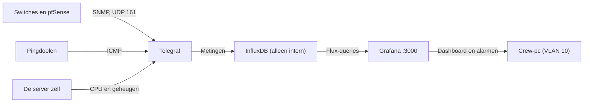
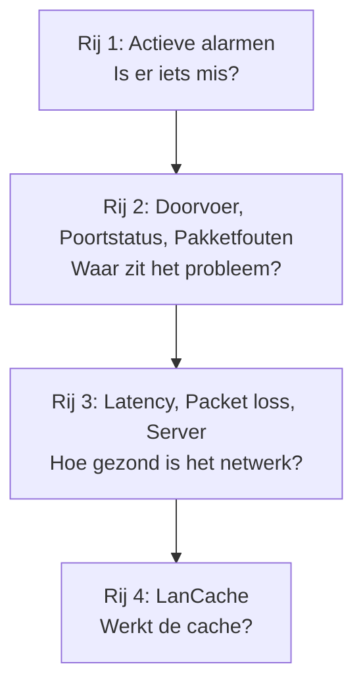
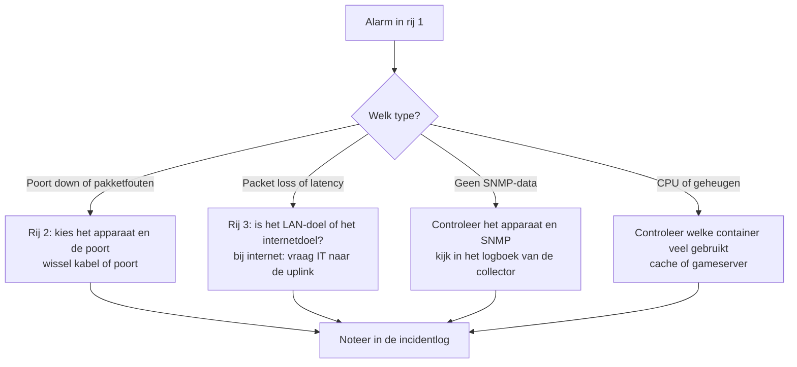

# Monitoring-stack

Met één commando start de volledige monitoring van de LAN-party: Telegraf, InfluxDB en Grafana, met de datasource, het dashboard en de alarmen al ingesteld. De achtergrond en de gekozen KPI's staan in [MONITORING_STACK.md](../netwerkontwerp/MONITORING_STACK.md).

**Nieuw hierin? Begin met de [HANDLEIDING](HANDLEIDING.md).** Die legt stap voor stap uit hoe je `.env` invult en wat elk onderdeel doet, zonder voorkennis.

Wil je alleen de opstelling voor 70 deelnemers starten? Ga dan naar [lan-70/](lan-70/README.md). Daar staat een ingevulde `.env` klaar.

## Inhoud

1. [Starten](#starten)
2. [Hoe het werkt](#hoe-het-werkt)
3. [Het dashboard uitgelegd](#het-dashboard-uitgelegd)
4. [De alarmen](#de-alarmen)
5. [Apparaten toevoegen](#apparaten-toevoegen)
6. [Meldingen instellen](#meldingen-instellen)
7. [Als iets niet werkt](#als-iets-niet-werkt)
8. [Veiligheid en wat getest is](#veiligheid-en-wat-getest-is)

## Starten

1. Kopieer `.env.example` naar `.env` en vul de lege waarden in. Een sterk geheim maak je met `openssl rand -hex 32`.
2. Pas in `.env` de lijst met apparaten (`SNMP_APPARATEN`) en de pingdoelen (`PING_DOELEN`) aan.
3. Start de stack:

```bash
docker compose up -d
```

4. Open Grafana op `http://<server>:3000`, log in met de gegevens uit `.env` en open het dashboard **LAN-party overzicht** in de map **LAN-party**.

| Doel | Commando |
| :-- | :-- |
| Status bekijken | `docker compose ps` |
| Logboek van de collector | `docker compose logs -f telegraf` |
| Stoppen, data blijft | `docker compose down` |
| Stoppen en alle data wissen | `docker compose down -v` |

### Voordat er data verschijnt

- **SNMP aanzetten** op de switches en pfSense, met een alleen-lezen community die overeenkomt met `SNMP_COMMUNITY`. Beperk die tot het IP van deze server. De collector gebruikt SNMP versie 2c.
- **Firewall:** de server (VLAN 20) moet UDP 161 naar het beheernetwerk (VLAN 10) mogen, de crew-pc (VLAN 10) moet TCP 3000 naar de server mogen, en de server moet de pingdoelen kunnen bereiken.

## Hoe het werkt

Telegraf haalt elke 10 seconden metingen op, InfluxDB bewaart ze, en Grafana toont ze en bewaakt de grenzen.



| Service | Doel | Bereikbaar |
| :-- | :-- | :-- |
| InfluxDB | Bewaart de metingen (standaard 30 dagen) | Alleen binnen de stack |
| Telegraf | Haalt metingen op | Geen poort |
| Grafana | Dashboard en alarmen | Poort 3000 |

## Het dashboard uitgelegd

Het dashboard heeft vier rijen. Lees het van boven naar onder: eerst of er iets mis is, dan waar, en dan hoe erg.



### Bovenaan: filters

| Instelling | Wat het doet |
| :-- | :-- |
| **Apparaat** | Kiest welke switch of pfSense je in rij 2 bekijkt. Het gaat om het IP-adres. |
| **Poort** | Kiest welke poorten je ziet. Standaard alle. Kies er één om in te zoomen. |
| Tijdvenster (rechtsboven) | Standaard het laatste uur. Vergroot het om een trend te zien. |
| Verversen (rechtsboven) | Staat op elke 10 seconden, net als de metingen. |

### Rij 1: Actieve alarmen

Toont de alarmen die nu afgaan (Firing) of bijna afgaan (Pending). **Leeg betekent dat alles in orde is.** Een rood item is een probleem. Klik erop voor de uitleg en wat je moet doen. De regels staan onder *Alerting, Alert rules*.

### Rij 2: waar zit het probleem

| Paneel | Wat het toont | Zo lees je het | Probleem als |
| :-- | :-- | :-- | :-- |
| **Doorvoer per poort** | Verkeer in en uit per poort, in bits per seconde | Elke lijn is één poort en één richting. Een hoge lijn is veel verkeer. | De uplink zit tegen zijn maximum, of een poort doet plots niets meer |
| **Poortstatus** | De laatste status per poort | Groen is Up, rood is Down | Een poort die in gebruik zou zijn staat op Down |
| **Pakketfouten per poort** | Nieuwe fouten per tijdsinterval | Een vlakke lijn op nul is goed | De lijn stijgt: slechte kabel of poort |

Voor de **WAN-doorvoer** kies je bij Apparaat de pfSense en bij Poort de WAN-interface. Dat toont de belasting van de schooluplink.

### Rij 3: hoe gezond is het netwerk

| Paneel | Wat het toont | Zo lees je het | Probleem als |
| :-- | :-- | :-- | :-- |
| **Latency en jitter** | Reactietijd naar de pingdoelen en de spreiding daarvan | Lage en rustige lijnen zijn goed. Jitter is hoe wisselvallig de latency is. | Pieken, of een stijgende lijn |
| **Packet loss** | Percentage verloren pings | 0% is goed | Alles boven 0% blijft een signaal |
| **Server: CPU en geheugen** | Belasting van de server | Ruim onder 100% | Aan de grens, dan wordt de cache of gameserver traag |

Een pingdoel op het internet (de uplink) heeft van nature meer latency dan een doel op het LAN. Vergelijk de twee: is alleen het internetdoel traag, dan zit het probleem aan de uplink.

### Rij 4: LanCache

Toont de verhouding tussen hits (lokaal geleverd) en misses (van het internet gehaald). Veel hits betekent dat de cache zijn werk doet. Het paneel is leeg zolang het optionele blok voor het LanCache-logboek in `telegraf/telegraf.conf` uit staat.

### Er gaat een alarm af: wat nu?



De vervolgstappen per symptoom staan ook in het [draaiboek](../draaiboek/03_EVENEMENT.md), onder Bekende problemen en oplossingen.

## De alarmen

De alarmen staan in [alarmen.yml](grafana/provisioning/alerting/alarmen.yml) en worden bij het starten automatisch geladen. Ze controleren elke 30 seconden. De grenzen zijn mijn eerste schatting. Pas ze aan na de labproef.

| Alarm | Gaat af als | Na | Ernst |
| :-- | :-- | :-- | :-- |
| Poort is down gegaan | Een poort die het afgelopen kwartier up was, is nu down | 30 s | Kritiek |
| Pakketfouten nemen toe | Meer dan 10 nieuwe fouten in 5 minuten | 2 min | Waarschuwing |
| Packet loss | Meer dan 2% gemiddeld over 5 minuten | 2 min | Kritiek |
| Latency is hoog | Gemiddeld boven 50 ms over 5 minuten | 5 min | Waarschuwing |
| Geen SNMP-data van een apparaat | Een apparaat levert al meer dan een minuut geen metingen, of de collector ligt stil | 1 min | Kritiek |
| Server-CPU is hoog | Boven 90% gedurende 5 minuten | 5 min | Waarschuwing |
| Server-geheugen is hoog | Boven 90% gedurende 5 minuten | 5 min | Waarschuwing |

Het alarm voor een poort die down gaat kijkt bewust alleen naar poorten die eerst up waren. Ongebruikte switchpoorten staan altijd op Down en zouden anders voortdurend afgaan.

Een grens aanpassen: wijzig het getal bij `params` in `alarmen.yml` en start Grafana opnieuw met `docker compose restart grafana`.

## Apparaten toevoegen

Alle apparaten staan op één plek: de lijst `SNMP_APPARATEN` in `.env`, met komma's tussen de IP-adressen. Pingdoelen staan op dezelfde manier in `PING_DOELEN`.

```ini
SNMP_APPARATEN=10.10.10.1,10.10.10.2,10.10.10.3
PING_DOELEN=10.10.20.10,1.1.1.1
```

Een extra switch toevoegen gaat zo:

1. Zet SNMP aan op de nieuwe switch, met dezelfde community.
2. Zet het IP-adres achter de lijst in `.env`.
3. Draai `docker compose up -d`. Telegraf start dan opnieuw met de nieuwe lijst. De data blijft bewaard.

Wat daarna vanzelf meegroeit en wat niet:

| Onderdeel | Past zich vanzelf aan? |
| :-- | :-- |
| Nieuwe switch in de lijst zetten | Nee, dat doe je zelf in `.env` |
| Poorten van een switch | Ja, Telegraf leest de hele poortentabel |
| Dropdowns **Apparaat** en **Poort** in het dashboard | Ja, ze tonen elk apparaat dat het afgelopen uur gemeten is |
| De alarmen | Ja, ze kijken naar alle apparaten in de data |

Het alarm *Geen SNMP-data van een apparaat* ziet alleen apparaten die het afgelopen uur gemeten zijn. Een nieuwe switch die nooit antwoordt, valt dus niet op in Grafana. Je ziet dat wel in `docker compose logs telegraf`. Een scan die zelf nieuwe apparaten vindt, bestaat niet.

## Meldingen instellen

Zonder extra instelling zie je afgaande alarmen alleen in Grafana zelf. Je krijgt dus geen bericht. Wil je die wel krijgen, bijvoorbeeld in Discord, via een webhook of per e-mail:

1. Ga in Grafana naar *Alerting, Contact points* en kies *Add contact point*.
2. Kies het type (bijvoorbeeld Discord of Webhook), vul de gegevens in en test.
3. Ga naar *Notification policies* en zet dit contactpunt als standaard.

E-mail werkt pas nadat je SMTP instelt in Grafana. Dat staat niet in deze stack.

## Als iets niet werkt

| Symptoom | Oorzaak en oplossing |
| :-- | :-- |
| Alle panelen leeg | Draait Telegraf? Controleer met `docker compose ps` en `docker compose logs --tail 30 telegraf` |
| Poortpanelen leeg | SNMP staat niet aan op het apparaat, de community klopt niet, of de firewall blokkeert UDP 161 |
| Alarm "Geen SNMP-data" gaat af | Hetzelfde als hierboven, maar dan voor één apparaat. Kijk welk IP in het alarm staat |
| Timeouts in de Telegraf-logs | Het apparaat op dat IP bestaat niet of antwoordt niet |
| Latency en loss leeg | Het pingdoel is niet bereikbaar, of ICMP is geblokkeerd |
| Stack start niet, melding "Zet X in .env" | Er ontbreekt een waarde in `.env` |
| LanCache-paneel leeg | Het optionele blok in `telegraf.conf` staat nog uit |

## Veiligheid en wat getest is

- `.env` staat in `.gitignore` en hoort nooit in git. Alleen de `.env.example`-bestanden staan in de repository.
- Telegraf en Grafana gebruiken hetzelfde InfluxDB-admintoken. Voor een langere opstelling maak je aparte tokens met alleen schrijf- en leesrechten.
- Toegang tot de Docker-socket (voor metingen per container) staat standaard uit, omdat die in feite root-rechten op de host geeft.
- De wachtwoorden die vroeger in `MONITORING_STACK.md` stonden, zijn gecommit. Beschouw ze als verbrand.
- SNMP versie 2c is de standaard. SNMPv3 is veiliger.

Getest op Docker Desktop (Windows): de stack start, Grafana laadt de datasource, het dashboard en de alarmen automatisch, de dashboardqueries zijn geldig, ping, CPU en geheugen leveren data, en de SNMP-keten werkt tegen een nagebootste agent.

Nog niet getest: echte switches en pfSense, het LanCache-logblok, metingen per container en een Linux-host.
