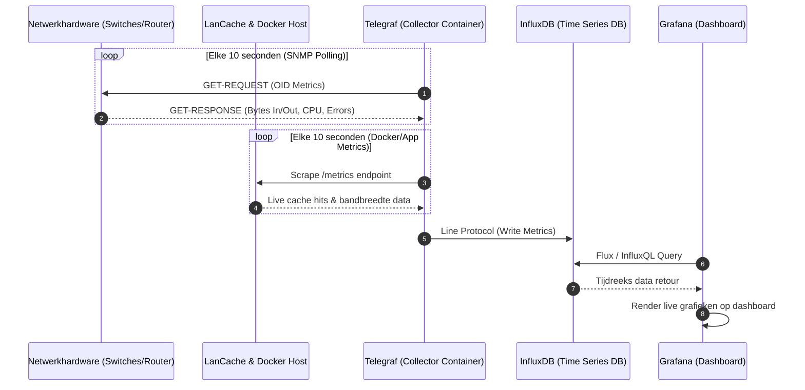

# Module 2: Moderne Netwerkmonitoring (Grafana-Stack)

Dit document beschrijft de technische opzet van de monitoring-pijplijn om realtime metrieken te verzamelen voor het projectverslag.

## 1. Architectuur van de Monitoring-pijplijn

De metrieken stromen vanuit de netwerkhardware en docker-services via een push/pull-mechanisme naar de tijdreeksdatabase, waarna Grafana de visualisatie verzorgt.



## 2. Docker Compose Deployment

De volledige **TIG-stack** (Telegraf, InfluxDB, Grafana) staat in de map [monitoring/](../monitoring/README.md), met een kant-en-klare Compose-file, de Telegraf-configuratie en een Grafana-dashboard. Alle wachtwoorden en tokens komen uit een `.env`-bestand dat niet in git staat.

```bash
cd monitoring
cp .env.example .env   # vul de waarden in
docker compose up -d
```

## 3. Aanbevolen Grafana KPI-Dashboards

Om de werking van het netwerk te bewijzen tijdens de Network Experience, dienen de volgende statistieken prominent op het hoofdscherm getoond te worden:

1. **WAN Internet Doorvoersnelheid:** Live netwerkverkeer (Mbps) op de pfSense WAN-interface om internetbelasting te monitoren.
2. **LanCache Hit Rate:** Een taart- of staafdiagram dat de verhouding toont tussen *Cache Hits* (lokaal geserveerd op 1 Gbps+) en *Cache Misses* (gedownload van internet).
3. **Core Switch Port Status:** Matrix-overzicht van alle switchpoorten die eventuele pakketfouten (CRC errors) of onverwachte 'flapping ports' direct visueel markeert.
4. **ICMP Jitter / Latency:** Realtime ping-metingen naar actieve game-nodes om de stabiliteit van de latency te waarborgen onder hoge netwerkdruk.
