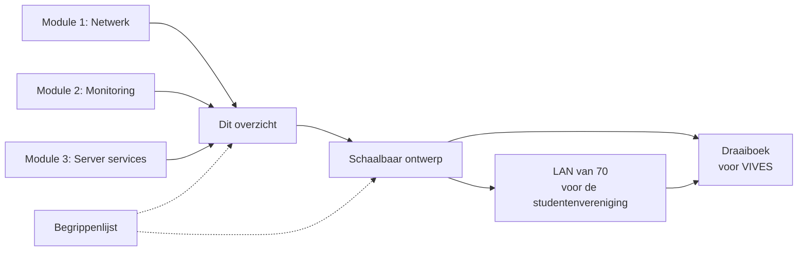
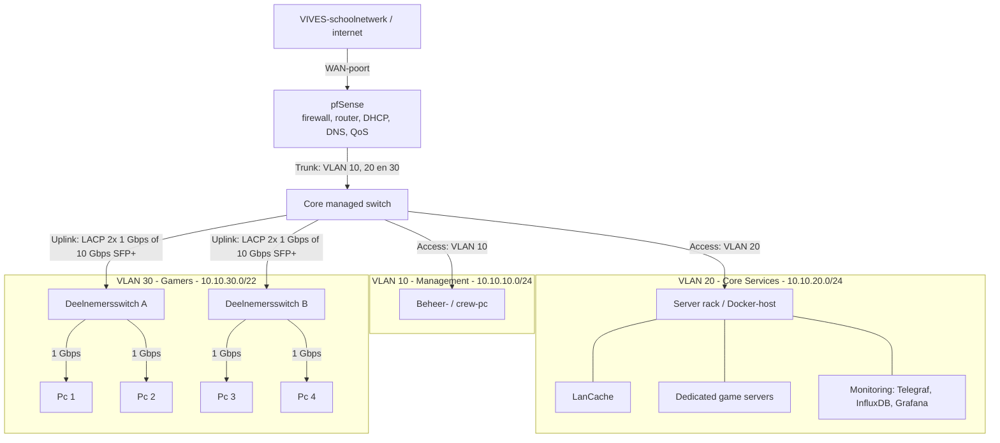
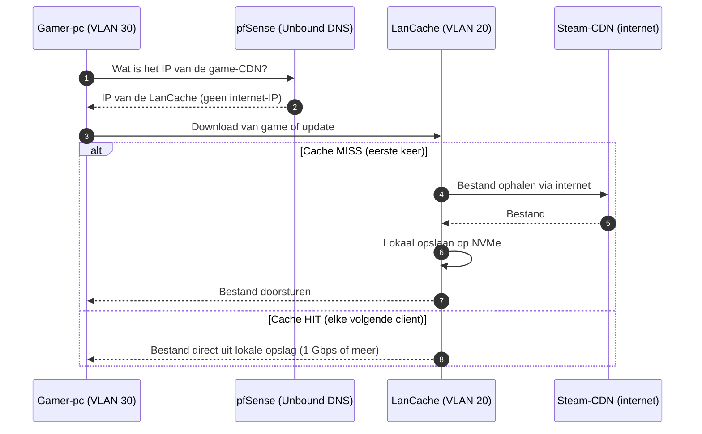
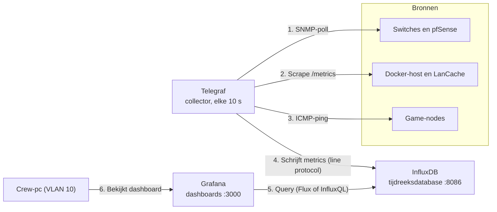
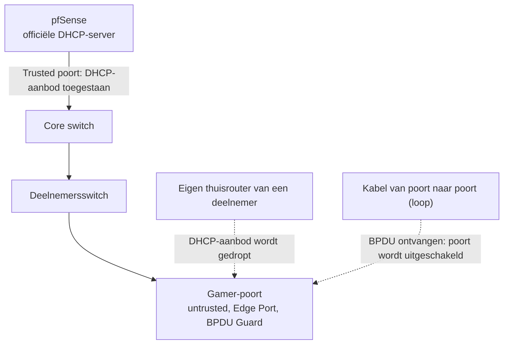
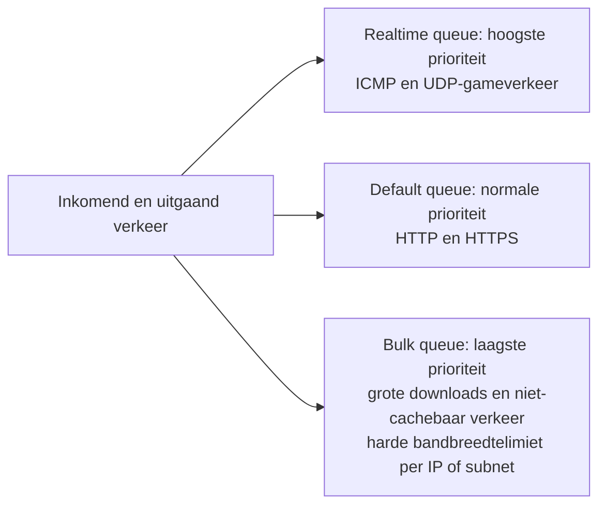
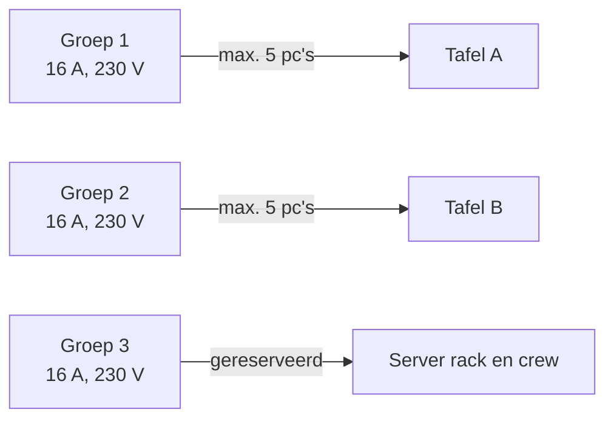

# Overzicht: Netwerk, Monitoring en Server Services

Hier vat ik module 1 ([NETWERK_ARCHITECTUUR.md](NETWERK_ARCHITECTUUR.md)), module 2 ([MONITORING_STACK.md](MONITORING_STACK.md)) en module 3 ([SERVER_SERVICES.md](SERVER_SERVICES.md)) samen, met verduidelijkte schema's en een lijst van openstaande punten. Alles hieronder is een **ontwerp**: ik sluit niets aan vóór de go/no-go van gate "Techniek" (zie [README](../README.md)).

## Leesroute

Dit overzicht zit in het midden. Links staan de drie modules waaruit het komt, rechts de documenten die erop voortbouwen. De [begrippenlijst](../gedeeld/BEGRIPPEN.md) gebruik ik bij alle documenten.

- [Schaalbaar ontwerp](SCHAALBAAR_ONTWERP.md)
- [LAN van 70](../lan-70/LAN_70_OPSTELLING.md)
- [Draaiboek](../draaiboek/00_OVERZICHT.md)

## 1. Het geheel in één blik

| Laag | Wat | Waar beschreven |
| --- | --- | --- |
| Routing en DNS | pfSense: firewall, router, DHCP, DNS (Unbound), QoS | Module 1 en 3 |
| Switching | Core switch + deelnemersswitches, VLANs, STP- en DHCP-beveiliging | Module 1 en 3 |
| Services | LanCache, game servers, monitoring (draaien op een Docker-host) | Module 2 en 3 |
| Fysiek | Bandbreedte per poort, stroom per groep | Module 1 |

## 2. Fysieke topologie

Lees van boven naar onder: internet, firewall, core switch, daarna drie gescheiden VLANs. De labels op de pijlen zeggen hoe elke poort is ingesteld.

## 3. Logisch ontwerp

| VLAN | Naam | Subnet | Bruikbare hosts | Inhoud |
| :-- | :-- | :-- | :-- | :-- |
| 10 | Management | `10.10.10.0/24` | 254 | Beheer van switches en router, crew-pc |
| 20 | Core Services | `10.10.20.0/24` | 254 | LanCache, game servers, monitoring |
| 30 | Gamers | `10.10.30.0/22` | 1022 | Deelnemers (`10.10.30.0` tot `10.10.33.255`) |

### Wie mag met wie praten (voorstel, nog te bevestigen)

Dit staat niet in mijn oorspronkelijke modules. Ik leid het af uit de VLAN-indeling en ik moet het nog in pfSense uitwerken.

| Van | Naar | Toegestaan | Reden |
| :-- | :-- | :-- | :-- |
| VLAN 30 (gamers) | pfSense | DNS (53), DHCP | Adres en naamresolutie |
| VLAN 30 | VLAN 20 | LanCache (80/443), poorten van de game servers | Downloads en spelen |
| VLAN 30 | VLAN 10 | Geblokkeerd | Deelnemers mogen niet bij beheer |
| VLAN 10 (crew) | VLAN 20 en 30 | Toegestaan | Beheer, Grafana (3000), InfluxDB (8086) |
| VLAN 20 | WAN | Toegestaan | LanCache moet bij een cache miss kunnen ophalen |

## 4. LanCache: DNS en cache hit of miss

De clients merken niets van de cache. pfSense (Unbound) beantwoordt de DNS-vraag voor game-CDN's met het IP van de LanCache, waarna de download daar terechtkomt.

Aandachtspunten:

- **Hardware:** NVMe-opslag en voldoende RAM, zodat meerdere gelijktijdige 1 Gbps-downloads de opslag niet de bottleneck maken.
- **Fallback (verplicht scenario 3 en 6):** valt de cache uit of wordt ze uitgeschakeld, dan moet de DNS-override verdwijnen. Clients resolven dan weer naar het echte internet en behouden toegang.
- Alleen voor toegelaten platformen (zie README).

## 5. Monitoring-pijplijn (TIG-stack)

Telegraf haalt elke 10 seconden metrics op, schrijft ze naar InfluxDB, en Grafana toont ze. De crew bekijkt het dashboard vanuit VLAN 10.

### Welke KPI komt waar vandaan

| KPI op het dashboard | Bron | Opmerking |
| :-- | :-- | :-- |
| WAN-doorvoer (Mbps) | SNMP op de pfSense WAN-interface | Toont de belasting van de schooluplink |
| LanCache hit rate | LanCache-metrics | Bron nog te bevestigen, zie punt 5 in sectie 9 |
| Poortstatus en CRC-errors | SNMP op de core switch | Detecteert ook flappende poorten |
| Latency en jitter | ICMP-pings naar game-nodes | Stabiliteit onder hoge belasting |

### Services van de stack

| Service | Image | Poort | Opslag |
| :-- | :-- | :-- | :-- |
| InfluxDB | `influxdb:2.7` | 8086 | volume `influxdb_data` |
| Telegraf | `telegraf` | geen | `telegraf.conf` (alleen-lezen) |
| Grafana | `grafana/grafana` | 3000 | volume `grafana_data` |

## 6. Beveiliging en stabiliteit op de switches

Twee risico's staan centraal: een loop door een verkeerd aangesloten kabel, en een eigen router van een deelnemer die adressen uitdeelt.

| Maatregel | Beschermt tegen | Instelling |
| :-- | :-- | :-- |
| RSTP (802.1w) | Switching loops en broadcast storms | Overal aan; herstel in ongeveer 1 seconde |
| Edge Port (PortFast) | Trage poortopstart voor eindgebruikers | Op alle poorten naar gamers |
| BPDU Guard | Een onbedoelde switch op een gamerpoort | Poort gaat direct uit bij ontvangen BPDU |
| DHCP Snooping | Rogue DHCP-servers | Alleen de uplink naar pfSense is Trusted; de rest Untrusted |

## 7. QoS op pfSense

Zware downloads mogen de ping van spelers niet verpesten. Het verkeer wordt daarom in drie queues verdeeld (pfSense Wizard, Multiple LAN/WAN).

## 8. Capaciteit

### Netwerk

- **Edge:** 1 Gbps full-duplex per pc.
- **Uplinks:** minimaal LACP 2x 1 Gbps, liefst 10 Gbps SFP+ naar de core switch, zodat gelijktijdige downloads geen bottleneck vormen.

### Stroom

Uitgangspunt is circa 500 W per gaming-pc bij piekbelasting.

| Stap | Berekening | Resultaat |
| :-- | :-- | :-- |
| Vermogen per groep | 230 V x 16 A | 3.680 W |
| Maximaal belasting (80%) | 3.680 W x 0,8 | 2.944 W |
| Pc's per groep | 2.944 W / 500 W = 5,9 | **5 pc's** (6 pc's = 3.000 W, boven de marge) |

Verdeel de tafels bewust over verschillende wandcontactdozen (groepen) in het VIVES-lab.

## 9. Openstaande punten

Bij het nalezen van mijn drie modules zijn me dingen opgevallen die ik nog moet oplossen of laten bevestigen.

1. **Geheimen in de repository (opgelost).** In de Compose-file in `MONITORING_STACK.md` stonden vaste wachtwoorden voor InfluxDB en Grafana. Dat botste met de projectregel dat er geen geheimen in de repo staan. De stack staat nu in [monitoring/](../monitoring/README.md) en leest alles uit een `.env`-bestand dat in `.gitignore` staat. Omdat de oude wachtwoorden al gecommit waren, beschouw ik ze als verbrand.
2. **Eigen router en DHCP vragen toestemming.** Mijn ontwerp gebruikt pfSense als router, DHCP- en DNS-server. De README zegt dat dit niet mag zonder expliciete toestemming van IT. Ik moet dit laten bevestigen vóór gate "Techniek".
3. **Subnetgrootte versus stroom.** VLAN 30 biedt ruimte aan 1022 hosts, maar twee stroomgroepen dragen slechts 10 pc's. De werkelijke capaciteit wordt door stroom en tafels bepaald, niet door het subnet. De capaciteit van het evenement heb ik nog niet bepaald.
4. **Zes of vijf pc's per groep.** In module 1 schreef ik "5 tot 6", maar 6 pc's overschrijden de 80%-marge. Monitors en switches heb ik bovendien niet meegerekend.
5. **Bron van de LanCache-metrics.** In module 2 ga ik uit van een `/metrics`-endpoint op de LanCache. Ik moet nog controleren of dat bestaat of dat ik een aparte exporter of logparser nodig heb.
6. **Ontbrekende `telegraf.conf` (opgelost).** De configuratie staat nu in `monitoring/telegraf/telegraf.conf`, zonder community string. Die komt uit `.env`. Ik moet de SNMP-configuratie nog testen op echte switches en pfSense.
7. **Vaste versies (opgelost).** De images in `monitoring/` hebben vaste versies, en die staan in `.env.example`.
8. **Echte uplinkcapaciteit onbekend.** De schooluplink bepaalt hoeveel een cache miss kost. Ik vraag de bandbreedte op bij IT en neem ze op in het bandbreedteplan.
9. **Firewallregels tussen VLANs** (sectie 3) heb ik nog nergens uitgewerkt.

## 10. Hoe nu verder

Een aantal van deze punten, zoals de VLAN-indeling en de plaats van de cache, werk ik uit in het [schaalbare ontwerp](SCHAALBAAR_ONTWERP.md). Daar bouw ik een opstelling die van 100 tot 10 000 deelnemers meegroeit.
