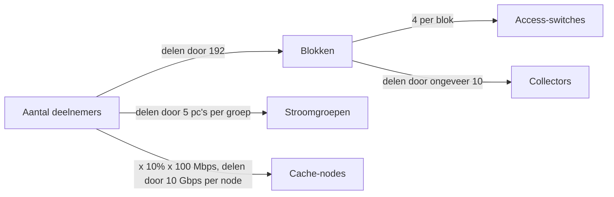
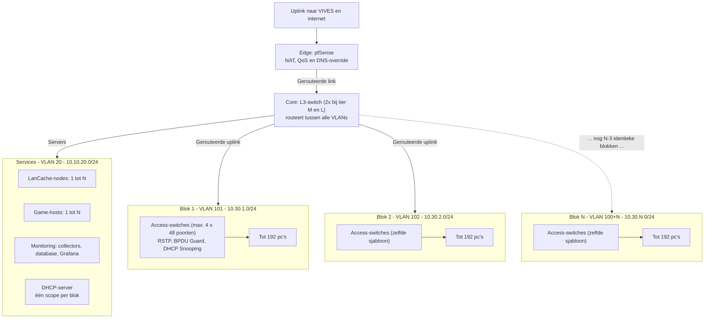
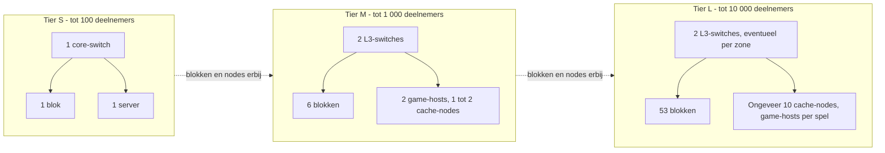

# Schaalbaar ontwerp: van 100 tot 10 000 deelnemers

In dit document laat ik zien hoe het netwerk kan meegroeien met het aantal deelnemers, zonder dat het ontwerp verandert. Ik vervang hiermee voor de gamers het enkele VLAN 30 (`10.10.30.0/22`) uit [NETWERK_ARCHITECTUUR.md](NETWERK_ARCHITECTUUR.md). Het is een **voorstel**: ik heb het nog niet afgestemd met IT en nog niet getest.

Elk gelinkt begrip leg ik uit in de [begrippenlijst](../gedeeld/BEGRIPPEN.md).

## 1. Het probleem

Nu zitten alle gamers in **één [VLAN](../gedeeld/BEGRIPPEN.md#vlan)** met een [`/22`-subnet](../gedeeld/BEGRIPPEN.md#cidr). Dat is één groot [broadcastdomein](../gedeeld/BEGRIPPEN.md#broadcastdomein). Bij 100 pc's werkt dat. Bij 10 000 niet, om drie redenen:

1. Elke broadcast (zoals [ARP](../gedeeld/BEGRIPPEN.md#arp) en [DHCP](../gedeeld/BEGRIPPEN.md#dhcp)-discover) bereikt alle pc's.
2. Eén [switching loop](../gedeeld/BEGRIPPEN.md#switching-loop) of [rogue DHCP-server](../gedeeld/BEGRIPPEN.md#rogue-dhcp-server) legt dan iedereen plat.
3. Een `/22` heeft maar 1 022 adressen. Voor 10 000 pc's is dat veel te weinig.

## 2. De oplossing: een vast [blok](../gedeeld/BEGRIPPEN.md#blok)

Ik ontwerp één bouwsteen en kopieer die zo vaak als nodig.

| Eigenschap van een blok | Waarde |
| :-- | :-- |
| Aantal pc's | maximaal 192 (4 [access-switches](../gedeeld/BEGRIPPEN.md#access-switch) van 48 poorten) |
| [VLAN](../gedeeld/BEGRIPPEN.md#vlan) | `100 + n`, dus blok 1 is VLAN 101 |
| [Subnet](../gedeeld/BEGRIPPEN.md#subnet) | `10.30.n.0/24`, dus blok 1 is `10.30.1.0/24` |
| [Gateway](../gedeeld/BEGRIPPEN.md#gateway) | `10.30.n.1`, op de [core-switch](../gedeeld/BEGRIPPEN.md#core-switch) |
| [Uplink](../gedeeld/BEGRIPPEN.md#uplink) naar de core | 10 Gbps (of [LACP](../gedeeld/BEGRIPPEN.md#lacp) 2 x 1 Gbps bij kleine opstelling) |
| Beveiliging | [RSTP](../gedeeld/BEGRIPPEN.md#rstp), [BPDU Guard](../gedeeld/BEGRIPPEN.md#bpdu-guard), [DHCP snooping](../gedeeld/BEGRIPPEN.md#dhcp-snooping) |

Een `/24` heeft 254 bruikbare adressen. Met 192 pc's blijven er 62 over voor andere apparaten en reserve.

### Rekenvoorbeeld

Aantal blokken = deelnemers gedeeld door 192, naar boven afgerond.

| Deelnemers | Berekening | Blokken |
| :-- | :-- | :-- |
| 100 | 100 / 192 = 0,52 | 1 |
| 1 000 | 1 000 / 192 = 5,21 | 6 |
| 10 000 | 10 000 / 192 = 52,08 | 53 |

Groeien of krimpen betekent dus alleen blokken erbij zetten of weghalen. De configuratie van een blok kan ik kopiëren, alleen het nummer `n` verandert.

Vanuit het aantal deelnemers volgt de rest van de opstelling bijna vanzelf. Dit schema laat zien welke rekenstap bij welk onderdeel hoort:

## 3. Drie regels

Ik hou me aan drie regels:

1. **Een blok is de kleinste eenheid.** Geen halve blokken en geen blokken met een eigen configuratie.
2. **[Routering](../gedeeld/BEGRIPPEN.md#routering) gebeurt op de core, niet op de firewall.** Een [L3-switch](../gedeeld/BEGRIPPEN.md#l3-switch) routeert in hardware en is veel sneller dan [pfSense](../gedeeld/BEGRIPPEN.md#pfsense) in software. Zou al het verkeer langs de firewall moeten, dan is die bij 10 000 pc's de [bottleneck](../gedeeld/BEGRIPPEN.md#bottleneck). pfSense blijft alleen aan de rand voor internet, [NAT](../gedeeld/BEGRIPPEN.md#nat), [QoS](../gedeeld/BEGRIPPEN.md#qos) en de [DNS-override](../gedeeld/BEGRIPPEN.md#dns-override).
3. **Een storing blijft in zijn blok.** Omdat elk blok een eigen broadcastdomein is, treft een loop of rogue DHCP-server hoogstens 192 pc's.

## 4. Architectuur

Samen geven de blokken en de drie regels de volgende opbouw. Let op dat de blokken allemaal dezelfde vorm hebben en dat de services op één plek staan.

Hoe een pc een adres krijgt: de DHCP-broadcast van een pc blijft in zijn blok. De gateway stuurt hem via [DHCP-relay](../gedeeld/BEGRIPPEN.md#dhcp-relay) door naar de DHCP-server in VLAN 20. Die kiest uit de [DHCP-scope](../gedeeld/BEGRIPPEN.md#dhcp-scope) van dat blok. Zo heb ik maar één DHCP-server nodig.

## 5. Wat schaalt er nog meer mee

### Adressering

| Netwerk | Plan | Opmerking |
| :-- | :-- | :-- |
| Gamers | `10.30.0.0/16`, één `/24` per blok | Vervangt `10.10.30.0/22` |
| Core Services | `10.10.20.0/24` | Blijft gelijk; 254 adressen volstaan |
| Management | `10.10.10.0/23` | Was `/24`. Bij 53 blokken zijn er ongeveer 265 switches, en een `/24` heeft er maar 254 |

### [LanCache](../gedeeld/BEGRIPPEN.md#lancache)

Het aantal cache-nodes volgt uit de verwachte piek:

`aantal nodes = piek / doorvoer per node`, met `piek = deelnemers x aandeel dat tegelijk downloadt x snelheid per download`.

Rekenvoorbeeld met mijn **aannames** (10% downloadt tegelijk, 100 Mbps per download, 10 Gbps per node). Deze getallen meet ik nog in de labproef.

| Deelnemers | Piek | Nodes |
| :-- | :-- | :-- |
| 100 | 1 Gbps | 1 |
| 1 000 | 10 Gbps | 1 |
| 10 000 | 100 Gbps | 10 |

Bij meer nodes moet de DNS-override clients over de nodes verdelen. Elke node heeft een eigen cache, dus de [hitratio](../gedeeld/BEGRIPPEN.md#cache-hit-en-cache-miss) daalt als een client niet steeds dezelfde node gebruikt. Dat wil ik in het lab testen.

### Monitoring

Eén [collector](../gedeeld/BEGRIPPEN.md#collector) kan niet onbeperkt veel apparaten aan. Daarom plan ik dit:

- Eén collector per ongeveer 10 blokken.
- Alleen uplinks en servers worden elke 10 s [gepolld](../gedeeld/BEGRIPPEN.md#polling). Eindpoorten alleen op foutentellers, bijvoorbeeld elke 30 tot 60 s.
- [Downsampling](../gedeeld/BEGRIPPEN.md#downsampling) instellen, zodat [InfluxDB](../gedeeld/BEGRIPPEN.md#influxdb) niet eindeloos groeit.
- Of één InfluxDB-node bij 10 000 deelnemers genoeg is, heb ik niet getest. Dat meet ik in de labproef.

### [Redundantie](../gedeeld/BEGRIPPEN.md#redundantie)

Bij tier S volstaat één core-switch. Bij M en L zijn het er twee, zodat een uitval niet alles raakt.

## 6. Schaaltabel per [tier](../gedeeld/BEGRIPPEN.md#tier)

| | Tier S | Tier M | Tier L |
| :-- | :-- | :-- | :-- |
| Deelnemers | tot 100 | tot 1 000 | tot 10 000 |
| Blokken | 1 | 6 | 53 |
| Eindpoorten | 192 | 1 152 | 10 176 |
| Core | 1 core-switch (liefst L3, zie [LAN 70](../lan-70/LAN_70_OPSTELLING.md#waar-staat-de-cache)) | 2 L3-switches | 2 L3-switches, eventueel een tussenlaag per zone |
| Cache-nodes (rekenvoorbeeld) | 1 | 1 tot 2 | ongeveer 10 |
| Game-hosts | 1 ([Docker-host](../gedeeld/BEGRIPPEN.md#docker-host) met alles erop) | 2 | per spel of per regio |
| Collectors | 1 | 1 tot 2 | ongeveer 6 |
| [Stroomgroepen](../gedeeld/BEGRIPPEN.md#stroomgroep) (5 pc's per groep) | 20 | 200 | 2 000 |

Zo groeit de opstelling van tier naar tier. Er komen alleen blokken en nodes bij, de vorm blijft gelijk:

## 7. De grens zit niet in het netwerk

10 000 pc's van 500 W is 5 MW. Dat past niet in een lokaal met wandcontactdozen en vraagt een evenementenhal met eigen verdeelkasten. Het netwerk schaalt dus verder dan de locatie. Ik gebruik tier L daarom vooral als ontwerptoets, en bij het kiezen van een locatie is de stroomcapaciteit voor mij de eerste beperking.

## 8. Wat verandert ten opzichte van de huidige modules

| Onderdeel | Nu | Voorstel |
| :-- | :-- | :-- |
| VLAN 30 | Eén `10.10.30.0/22` | Eén VLAN en `/24` per blok |
| Routering tussen VLANs | pfSense | L3-switch; pfSense alleen aan de rand |
| DHCP | Op pfSense | Aparte DHCP-server met relay |
| Management-VLAN | `10.10.10.0/24` | `10.10.10.0/23` |
| Switchbeveiliging (module 3) | Ongewijzigd | Ongewijzigd, maar per blok toegepast |
| Monitoring | Eén collector | Eén collector per ongeveer 10 blokken |

## 9. Hoe nu verder

Voor een concrete uitwerking van tier S, met poortenplan en materiaallijst, zie [LAN_70_OPSTELLING.md](../lan-70/LAN_70_OPSTELLING.md). Hoe zo'n evenement georganiseerd wordt, staat in het [draaiboek](../draaiboek/00_OVERZICHT.md).
