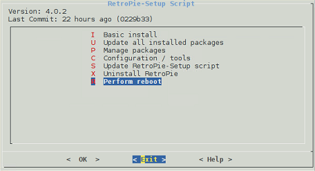

# installatie van retropi op pc ( handleiding )

## doelstelling

een pc ombouwen naar een functionele werkende arcade kast met retropi-software.

deze handleiding is bedoeld voor mensen die een pc willen ombouwen naar een arcade kast met retropi-software. Het doel is om een overzicht te geven van de stappen die nodig zijn om dit proces succesvol te voltooien.

## benodigdheden

- een pc (minipc of andere pc met een linux besturingssysteem)
- een voldoende grote hdd of ssd of nvme schijf
- een usb-stick van minimaal 8GB
- een werkende internetverbinding
- een arduino mini (optioneel, voor een zelfgemaakte controller te maken )
- een monitor of tv met hdmi/displayport aansluiting
- een toetsenbord en muis (voor de installatie)
- eventueel een arcade kast of behuizing (optioneel, voor de uiteindelijke opstelling)

### software

- retropi image (te instaleren via een script in linux)
- een image writer software (zoals [**balenaEtcher**](https://etcher.balena.io/#download-etcher)) of een [**Ventoy**](https://sourceforge.net/projects/ventoy/files/) usb stick
- een linux besturingssysteem [**ubuntu  26.04.1 LTS**](https://ubuntu.com/download/desktop)
- een terminal emulator (zoals putty of de ingebouwde terminal in linux)

### instalatie

[instalatie gids retropi op linux](https://retropie.org.uk/docs/Debian/)

1. installeer de linux distributie op de pc (bijvoorbeeld ubuntu 26.04.1 LTS) en zorg dat deze up-to-date is.

    ```bash
    sudo apt update && sudo apt upgrade -y
    ```

    ❗om het script te kunnen uitvoeren moet je de pc inloggen met een gebruiker die sudo rechten heeft.

2. instaleer de benodigde dependencies voor retropi:

    ```bash
    sudo apt install git dialog unzip xmlstarlet -y
    ```

3. download het retropi installatiescript van de officiële retropi github repository:

    ```bash
    git clone --depth=1 https://github.com/RetroPie/RetroPie-Setup.git
    ```

4. navigeer naar de gedownloade map:

    ```bash
    cd RetroPie-Setup
    ```

5. voer het installatiescript uit:

    ```bash
    sudo ./retropie_setup.sh
    ```

    het scherm zou er dan als volgt moeten uitzien:
    

6. volg de instructies op het scherm om retropi te installeren. Kies voor de optie "Basic Install" om de standaard installatie uit te voeren. ( deze is hetzelfde als de image die op een sd kaart wordt gezet voor een raspberry pi )

    ---

    ```basic install```

    installeert de kern van retropi, inclusief de emulators en de retropie-setup script.

    Dit is voldoende voor de meeste gebruikers.

    ---

    ```update all installed packages```

    update alle geïnstalleerde pakketten naar de nieuwste versie.

    ---

    ```manage packages```

    hiermee kun je extra pakketten installeren of verwijderen.

    ---

    ```configuration / tools```

    hiermee kun je de configuratie van retropi aanpassen, zoals het instellen van controllers, het aanpassen van de resolutie en het beheren van de opslag.

    ---

    ```update retropie-setup script```

    update het retropi-setup script naar de nieuwste versie.

    ---

    ```uninstall retropie```

    verwijdert retropi van de pc.

    ---

    ```perform reboot```

    herstart de pc.

    ---

7. na de installatie, herstart de pc en log opnieuw in. Retropi zou nu automatisch moeten starten.

8. 